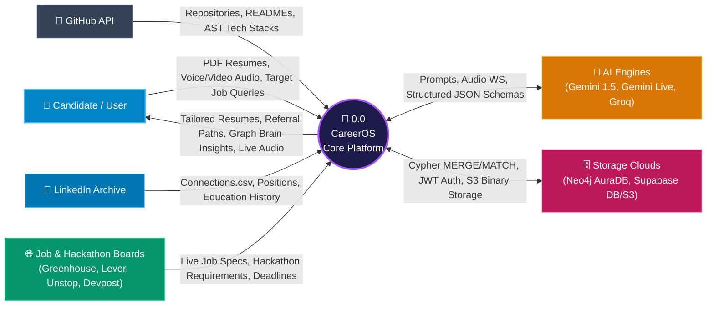
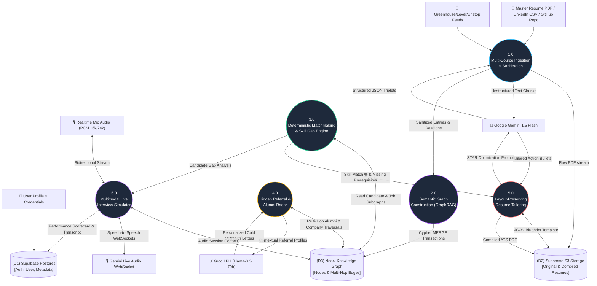
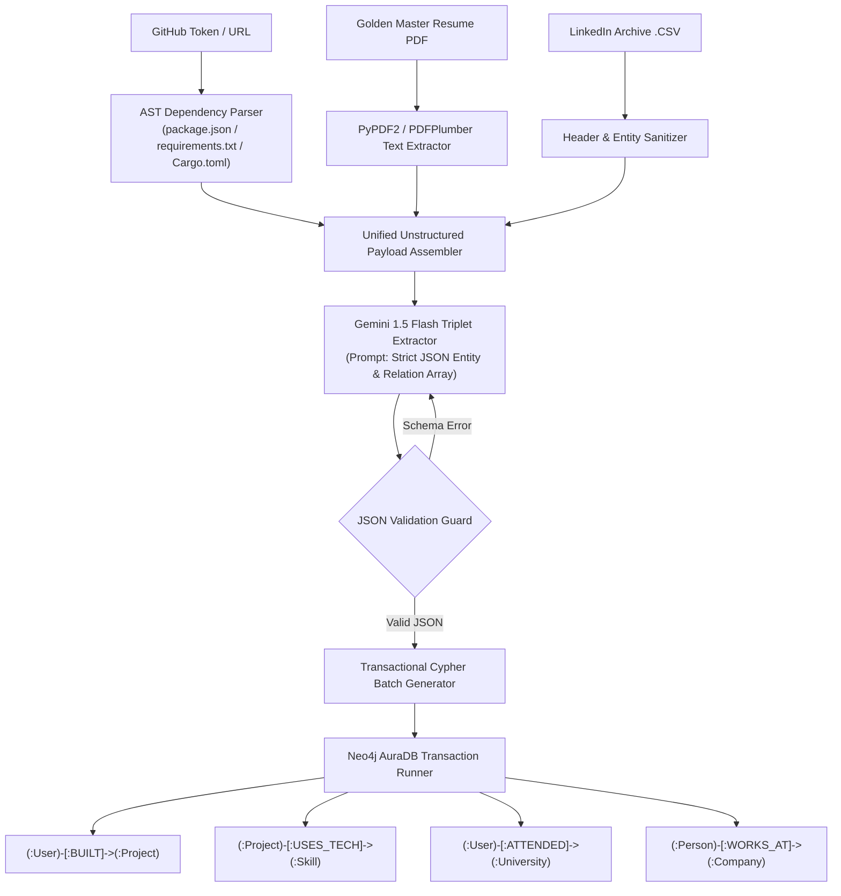
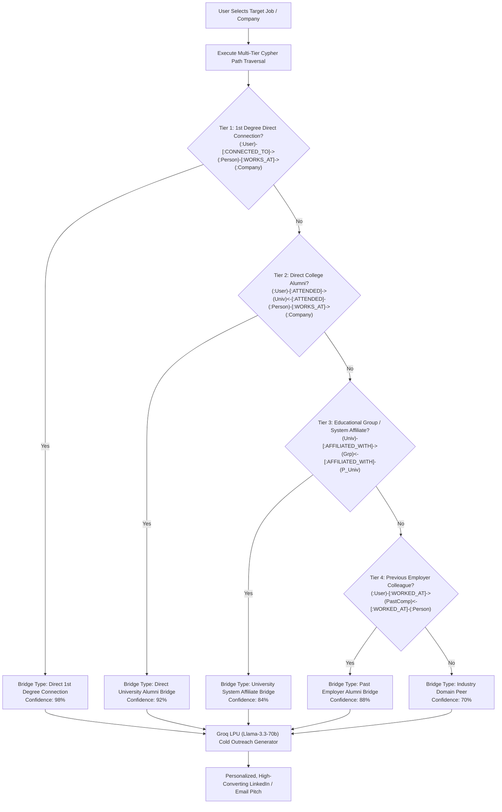
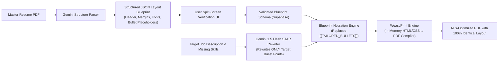
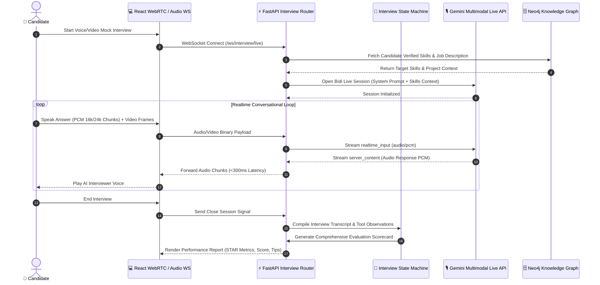
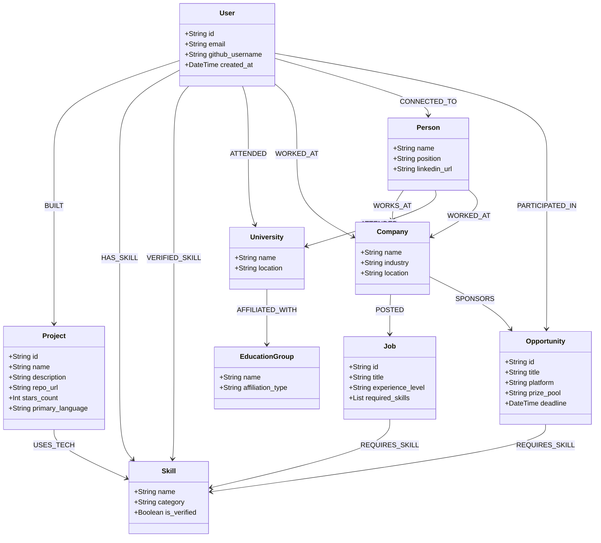

# CareerOS (GraphPaths AI) 🚀
### AI-Powered, GraphRAG Career Navigation, Hidden Referral Engine & Real-Time Multimodal Interview System

[](https://fastapi.tiangolo.com)
[](https://react.dev)
[](https://neo4j.com/cloud/platform/aura-graph-database/)
[](https://supabase.com)
[](https://aistudio.google.com)
[](https://ai.google.dev)
[-F55036?style=flat)](https://groq.com)
[](docs/ARCHITECTURE.md)

---

## 🌟 Executive Overview

**CareerOS** is a next-generation **GraphRAG-powered career intelligence, job search, and technical preparation platform**. Traditional career tools treat candidates as static, 1-dimensional keywords on flat PDFs. CareerOS synthesizes a candidate's complete digital footprint—including GitHub code repositories (AST parsing), verified project tech stacks, LinkedIn network archives, and master resumes—into an interconnected **Semantic Knowledge Graph** in Neo4j.

The system deterministically matches this knowledge graph against real-time job openings (Greenhouse, Lever) and hackathons/competitions (Unstop, Devpost), unlocks **multi-hop hidden referral bridges** (alumni, college systems, past companies), facilitates **complementary teammate discovery**, dynamically tailors resumes with **zero layout corruption** using a JSON Blueprint schema, and conducts **real-time multimodal voice & video mock technical interviews** via Google Gemini Live WebSockets.

---

## 🏛️ Comprehensive End-to-End System Architecture

The following diagram illustrates the complete architectural hierarchy across the Client Layer, Edge/Gateway, Core Processing Engines, AI Inference Layer, and Data/Storage Infrastructure:

```mermaid
graph TD
    %% Client & Edge Layer
    subgraph Client_Layer ["💻 1. Client & Edge Ingestion Layer"]
        WEB["React 18 + Vite Web Dashboard<br/>(TailwindCSS, Lucide, ForceGraph2D)"]
        EXT["Chrome MV3 Extension<br/>(DOM Recruiter & Job Scraper)"]
        LIVE_CLIENT["Live Interview Interface<br/>(PCM 16/24kHz Audio Streamer + Video Frames)"]
    end

    %% Gateway & Security
    subgraph API_Gateway ["🛡️ 2. API Gateway & Security"]
        GATEWAY["FastAPI v5.0 Asynchronous Gateway<br/>(CORS, Rate Limiting, OpenAPI Docs)"]
        AUTH_GUARD["Supabase JWT & OAuth Guard<br/>(Session & User Claims Validation)"]
        KEEPALIVE["Render Self-Ping Keep-Alive Worker<br/>(0s Cold Start Daemon)"]
    end

    %% Processing & Business Engines
    subgraph Core_Engines ["⚙️ 3. Deterministic Processing Engines"]
        INGEST_ENG["Multi-Source Ingestion Pipeline<br/>(PyPDF2, GitHub AST, CSV Normalizer)"]
        GRAPH_ENG["GraphRAG Engine<br/>(Cypher Query Builder & Traversal Planner)"]
        MATCH_ENG["Deterministic Matchmaker<br/>(Boolean Skill Intersection & Gap Scorer)"]
        REFERRAL_ENG["Hidden Referral Radar<br/>(Multi-Hop Path Tracing: Alumni/Group/Company)"]
        RESUME_ENG["JSON Blueprint Resume Tailorer<br/>(STAR Rewriter & WeasyPrint Compiler)"]
        INTERVIEW_ENG["Realtime Interview Orchestrator<br/>(State Machine & Feedback Generator)"]
    end

    %% AI & Inference Layer
    subgraph AI_Layer ["🧠 4. AI & Inference Ecosystem"]
        GEMINI_EXP["Google Gemini 1.5 Flash<br/>(1M Token Context Triplet & Resume Extractor)"]
        GEMINI_LIVE["Google Gemini Live WebSockets<br/>(Bidirectional Speech-to-Speech Realtime Audio)"]
        GROQ_LPU["Groq Cloud LPU (Llama-3.3-70b)<br/>(800+ Tokens/Sec Outreach & Graph Q&A)"]
    end

    %% Persistent Storage Layer
    subgraph Storage_Layer ["💾 5. Data & Knowledge Storage Layer"]
        NEO4J[("Neo4j AuraDB Graph<br/>(Nodes: User, Project, Skill, Company, Person, Univ)")]
        SUPA_DB[("Supabase PostgreSQL<br/>(User Auth, Session Logs, Metadata)")]
        SUPA_S3[("Supabase Storage (S3)<br/>(Raw Resumes, Tailored PDFs, Audio Dumps)")]
    end

    %% Edge to Gateway
    WEB -->|"HTTP / REST"| GATEWAY
    EXT -->|"REST Ingestion"| GATEWAY
    LIVE_CLIENT -->|"Bidirectional WS"| GATEWAY

    %% Gateway to Security & Engines
    GATEWAY --> AUTH_GUARD
    GATEWAY --> INGEST_ENG
    GATEWAY --> GRAPH_ENG
    GATEWAY --> MATCH_ENG
    GATEWAY --> REFERRAL_ENG
    GATEWAY --> RESUME_ENG
    GATEWAY --> INTERVIEW_ENG

    %% Engines to AI Layer
    INGEST_ENG -->|"Structured Extraction"| GEMINI_EXP
    RESUME_ENG -->|"STAR Bullet Synthesis"| GEMINI_EXP
    REFERRAL_ENG -->|"Cold Outreach Generation"| GROQ_LPU
    INTERVIEW_ENG <-->|"Sub-300ms Audio Stream"| GEMINI_LIVE

    %% Engines to Storage
    INGEST_ENG -->|"Atomic Cypher MERGE"| NEO4J
    GRAPH_ENG <-->|"Graph Traversal / Subgraphs"| NEO4J
    MATCH_ENG <-->|"Skill Intersection Queries"| NEO4J
    REFERRAL_ENG <-->|"Multi-Hop Bridge Queries"| NEO4J
    AUTH_GUARD <-->|"Auth Tokens & Profiles"| SUPA_DB
    RESUME_ENG -->|"Store Compiled PDFs"| SUPA_S3

    %% Styling
    style Client_Layer fill:#0f172a,stroke:#38bdf8,stroke-width:2px,color:#f8fafc
    style API_Gateway fill:#0f172a,stroke:#818cf8,stroke-width:2px,color:#f8fafc
    style Core_Engines fill:#0f172a,stroke:#34d399,stroke-width:2px,color:#f8fafc
    style AI_Layer fill:#0f172a,stroke:#fbbf24,stroke-width:2px,color:#f8fafc
    style Storage_Layer fill:#0f172a,stroke:#f472b6,stroke-width:2px,color:#f8fafc
```



---

## 📊 Complete Data Flow Diagrams (DFDs)

### 1. DFD Level 0: High-Level Context Diagram
The Level 0 context diagram demonstrates the boundary of the CareerOS System and its interactions with external candidate inputs, job market platforms, cloud databases, and AI inference engines:



---

### 2. DFD Level 1: System Decomposition Diagram
Level 1 decomposes the entire platform into six primary functional data processing domains:



---

### 3. DFD Level 2 Deep Dives

#### 📌 DFD 2.1: Graph Construction & Ingestion Flow
Detailed breakdown of how raw GitHub commits, AST manifests, and PDF resumes transform into Neo4j graph triplets:



#### 📌 DFD 2.2: Multi-Hop Hidden Referral Traversal Engine
Shows the multi-tier graph traversal hierarchy used to discover high-probability referral paths:



#### 📌 DFD 2.3: Layout-Preserving Resume Tailoring Engine
Illustrates how the JSON Blueprint Wizard prevents document corruption while maximizing ATS keyword compatibility:



#### 📌 DFD 2.4: Realtime Multimodal Live Interview System
Illustrates the low-latency bidirectional speech and video processing pipeline:



---

## 🕸️ Neo4j Knowledge Graph Schema & Entity Relationships

CareerOS models candidates, career assets, companies, and opportunities as a rich property graph:



### 🔑 Core Cypher Query: Multi-Hop Hidden Referral Discovery
```cypher
MATCH (u:User {id: $user_id})

// 1. Gather Candidate Context
OPTIONAL MATCH (u)-[:ATTENDED]->(univ:University)
OPTIONAL MATCH (univ)-[:AFFILIATED_WITH]->(grp:EducationGroup)
OPTIONAL MATCH (u)-[:WORKED_AT]->(past_comp:Company)

// 2. Identify Employees at Target Hiring Company
MATCH (p:Person)-[:WORKS_AT]->(c:Company)
WHERE (toLower(c.name) CONTAINS toLower($company) OR toLower($company) CONTAINS toLower(c.name))
  AND p.name IS NOT NULL

// 3. Match Overlapping Institutional Bridges
OPTIONAL MATCH (p)-[:ATTENDED]->(p_univ:University)
OPTIONAL MATCH (p_univ)-[:AFFILIATED_WITH]->(p_grp:EducationGroup)
OPTIONAL MATCH (p)-[:WORKED_AT]->(p_past_comp:Company)

RETURN DISTINCT p.name AS name,
       p.position AS position,
       c.name AS company,
       coalesce(p_univ.name, 'Alumni Network') AS college,
       CASE 
         WHEN (u)-[:CONNECTED_TO]->(p) THEN '1st Degree Direct Connection'
         WHEN univ IS NOT NULL AND p_univ IS NOT NULL AND univ = p_univ THEN 'Direct University Alumni Bridge'
         WHEN grp IS NOT NULL AND p_grp IS NOT NULL AND grp = p_grp THEN 'University System Alumni Bridge (' + grp.name + ')'
         WHEN past_comp IS NOT NULL AND p_past_comp IS NOT NULL AND past_comp = p_past_comp THEN 'Previous Employer Alumni Bridge'
         ELSE 'Industry Domain Peer'
       END AS bridge_type,
       CASE 
         WHEN (u)-[:CONNECTED_TO]->(p) THEN 98
         WHEN univ IS NOT NULL AND p_univ IS NOT NULL AND univ = p_univ THEN 92
         WHEN grp IS NOT NULL AND p_grp IS NOT NULL AND grp = p_grp THEN 84
         WHEN past_comp IS NOT NULL AND p_past_comp IS NOT NULL AND past_comp = p_past_comp THEN 88
         ELSE 70
       END AS confidence_score
ORDER BY confidence_score DESC
LIMIT 10;
```

---

## ⚡ Technical Stack & Free-Tier Optimization Matrix

CareerOS is engineered to run **100% on Free-Tier cloud infrastructure** with zero performance degradation or cold-start interruptions:

| Component | Technology | Free Tier Provider | Optimization & Resilience Mechanism |
| :--- | :--- | :--- | :--- |
| **Frontend UI** | React 18, Vite, TailwindCSS, Lucide | [Vercel](https://vercel.com) | Static asset CDN caching, zero server runtime cost, <250kB bundle. |
| **Backend API** | Python 3.11, FastAPI, Pydantic v2, Uvicorn | [Render](https://render.com) / [Koyeb](https://koyeb.com) | Background keep-alive self-ping worker eliminates 50s cold starts. |
| **Graph Database** | Neo4j AuraDB Free (Cypher 5) | [Neo4j Aura](https://neo4j.com/cloud/aura/) | Scoped multi-tenant IDs within the 200,000 node / 400,000 edge limit. |
| **Auth & Database** | Supabase (PostgreSQL 15 + Row Level Security) | [Supabase](https://supabase.com) | Native JWT verification, connection pooling via Supavisor. |
| **Object Storage** | Supabase S3-Compatible Storage | [Supabase](https://supabase.com) | Signed URL uploads for master resumes and compiled PDF outputs. |
| **Document AI** | Google Gemini 1.5 Flash | [Google AI Studio](https://aistudio.google.com) | 1,000,000 token context window for single-pass AST/resume triplet parsing. |
| **Speech AI** | Google Gemini Multimodal Live API | [Google AI Studio](https://ai.google.dev) | Sub-300ms bidirectional speech-to-speech WebSockets (PCM 16/24kHz). |
| **Sub-Second Chat** | Groq LPU (Llama-3.3-70b-versatile) | [Groq Cloud](https://console.groq.com) | 800+ tokens/sec throughput for instantaneous outreach generation. |
| **PDF Compilation** | WeasyPrint & Jinja2 Templates | Embedded Python Subprocess | In-memory HTML-to-PDF compilation with zero headless Chrome RAM overhead. |
| **Chrome Extension** | Manifest V3 Service Worker | Local Browser Runtime | Client-side DOM parsing with zero backend compute load. |

---

## 📂 Repository Architecture & Directory Map

```
careerOS-v5/
├── README.md                                # Master Architectural & System Documentation
├── .env.example                             # Environment Configuration Template
├── start-services.sh                        # Multi-service local orchestrator (Backend + Frontend)
├── render.yaml                              # Render Blueprint Deployment Spec
├── docs/                                    # Exhaustive Technical & Presentation Guides
│   ├── 00_DOCUMENTATION_INDEX.md            # Comprehensive documentation navigation tree
│   ├── 01_PROJECT_CONCEPT_AND_PROBLEM_STATEMENT.md # Problem definition & ROI analysis
│   ├── 02_MARKET_RESEARCH_AND_COMPETITIVE_ANALYSIS.md # Competitive landscape & benchmarks
│   ├── 03_SYSTEM_ARCHITECTURE_AND_TECH_STACK.md # Deep architectural specifications & graphs
│   ├── 04_MODULE_AND_FEATURE_DEEP_DIVES.md  # Deep dive into all 6 core sub-modules
│   ├── 05_SOURCE_CODE_AND_ALGORITHMIC_EXPLANATION.md # Algorithms, AST parsing & Cypher logic
│   ├── 06_HACKATHON_PPT_SLIDE_DECK_BLUEPRINT.md # Pitch deck blueprint & slide layouts
│   ├── 07_JURY_DEFENSE_AND_QA_PLAYBOOK.md   # Hard Q&A defense playbook for juries
│   ├── API_SPECIFICATION.md                 # Complete OpenAPI REST & WebSocket endpoints
│   ├── ARCHITECTURE.md                      # System architecture reference
│   ├── DATA_PIPELINE.md                     # Data pipeline step-by-step breakdown
│   ├── GRAPH_SCHEMA.md                      # Neo4j graph ontology & Cypher templates
│   └── SETUP_GUIDE.md                       # Comprehensive local & cloud setup guide
│
├── backend/                                 # FastAPI Async Backend Application
│   ├── app/
│   │   ├── main.py                          # Application entry point, CORS & lifecycle hooks
│   │   ├── core/                            # Configuration, DB connection pools & security
│   │   │   ├── config.py                    # Environment variable validation via Pydantic
│   │   │   ├── database.py                  # Neo4j & Supabase client initializers
│   │   │   └── security.py                  # JWT validation & user context extraction
│   │   ├── api/v1/                          # REST & WebSocket API Routers
│   │   │   ├── ingest.py                    # GitHub, Resume PDF & LinkedIn ingestion endpoints
│   │   │   ├── profile.py                   # Knowledge graph user profile queries
│   │   │   ├── matches.py                   # Deterministic skill matching & gap computation
│   │   │   ├── opportunities.py             # Hackathons & hiring challenge recommendations
│   │   │   ├── resume.py                    # JSON Blueprint tailoring & PDF compilation
│   │   │   ├── interview.py                 # Gemini Live WebSocket & mock interview engine
│   │   │   ├── brain.py                     # Graph Brain conversational Q&A router
│   │   │   ├── benchmark.py                 # Candidate percentile & industry benchmarking
│   │   │   └── health.py                    # Keep-alive & health check probes
│   │   ├── services/                        # Core Business Logic & AI Integrations
│   │   │   ├── neo4j_service.py             # Cypher query execution & graph traversal
│   │   │   ├── gemini_extractor.py          # Gemini 1.5 Flash structured triplet extractor
│   │   │   ├── gemini_live_service.py       # Speech-to-speech WebSocket live handler
│   │   │   ├── interview_service.py         # Interview state manager & scorecard evaluator
│   │   │   ├── resume_service.py            # JSON blueprint parser & WeasyPrint compiler
│   │   │   ├── matchmaking_service.py       # Skill gap & teammate discovery algorithms
│   │   │   ├── opportunities_service.py     # Unstop/Devpost opportunity feed aggregator
│   │   │   ├── github_service.py            # GitHub API & AST dependency parser
│   │   │   ├── linkedin_service.py          # LinkedIn archive CSV normalizer
│   │   │   └── llm_service.py               # Groq LPU high-speed inference integration
│   │   └── schemas/                         # Pydantic v2 Request/Response Data Models
│   ├── requirements.txt                     # Backend Python dependencies
│   └── Dockerfile                           # Containerized backend build spec
│
├── frontend/                                # React 18 + Vite Web Application
│   ├── src/
│   │   ├── components/                      # Reusable UI component library
│   │   │   ├── graph/                       # Interactive 2D/3D Force Graph visualizers
│   │   │   ├── resume/                      # Split-screen blueprint editor & previewer
│   │   │   ├── interview/                   # WebRTC audio visualizer & live video room
│   │   │   └── common/                      # Glassmorphism cards, badges & navigation
│   │   ├── pages/                           # Application Views (Dashboard, Matches, Brain)
│   │   ├── hooks/                           # Custom React hooks (useAuth, useWebSocket)
│   │   ├── services/                        # API client services (Axios / Fetch)
│   │   └── App.jsx                          # Root router & layout wrapper
│   ├── package.json                         # Frontend dependencies & scripts
│   ├── vite.config.js                       # Vite bundler configuration
│   └── tailwind.config.js                   # TailwindCSS theme & token extensions
│
└── extension/                               # Chrome Extension (Manifest V3)
    ├── manifest.json                        # Chrome MV3 manifest spec
    ├── background.js                        # Background service worker & sync daemon
    ├── content.js                           # DOM scraping script (Greenhouse, Lever, LinkedIn)
    └── popup/                               # Extension popup UI
```

---

## 🚀 Quick Start Guide (Local Setup)

### Prerequisites
- **Python 3.11+**
- **Node.js 18+ & npm**
- **Neo4j AuraDB Free Instance** (or local Neo4j Desktop)
- **Google Gemini API Key** ([Google AI Studio](https://aistudio.google.com))
- **Groq API Key** ([Groq Console](https://console.groq.com))
- **Supabase Project** ([Supabase](https://supabase.com))

---

### Step 1: Clone & Configure Environment Variables
```bash
git clone https://github.com/your-username/careerOS-v5.git
cd careerOS-v5
cp .env.example .env
```

Edit `.env` with your API keys:
```ini
# Neo4j AuraDB
NEO4J_URI=neo4j+s://your-subdomain.databases.neo4j.io
NEO4J_USERNAME=neo4j
NEO4J_PASSWORD=your-neo4j-password

# AI & LLM Inference
GEMINI_API_KEY=AIzaSy...your-gemini-key
GROQ_API_KEY=gsk_...your-groq-key

# Supabase Auth & Storage
SUPABASE_URL=https://your-project.supabase.co
SUPABASE_SERVICE_ROLE_KEY=your-supabase-service-key
SUPABASE_ANON_KEY=your-supabase-anon-key

# Optional GitHub Token (for higher rate limits)
GITHUB_ACCESS_TOKEN=ghp_...your-github-token
```

---

### Step 2: One-Click Local Launch
Run the automated startup script to initialize virtual environments, install dependencies, and launch both backend and frontend servers simultaneously:

```bash
chmod +x start-services.sh
./start-services.sh
```

Or start them manually in separate terminals:

#### Terminal 1 (FastAPI Backend):
```bash
cd backend
python3 -m venv venv
source venv/bin/activate
pip install -r requirements.txt
uvicorn app.main:app --reload --host 0.0.0.0 --port 8000
```

#### Terminal 2 (React Frontend):
```bash
cd frontend
npm install
npm run dev -- --port 3000
```

- **Web Dashboard**: `http://localhost:3000`
- **Interactive OpenAPI Docs**: `http://localhost:8000/docs`
- **Live WebSocket Endpoint**: `ws://localhost:8000/api/v1/interview/ws/live`

---

## 📚 Complete Documentation Index

For deep-dive technical explorations, slide decks, and jury defense guides, explore the `docs/` repository:

| Document | Direct Link | Content Summary |
| :--- | :--- | :--- |
| 🏗️ **System Architecture** | [docs/03_SYSTEM_ARCHITECTURE_AND_TECH_STACK.md](docs/03_SYSTEM_ARCHITECTURE_AND_TECH_STACK.md) | Full architectural breakdown, DFDs, free-tier limits, and tech rationale. |
| ⛓️ **Data Pipeline Guide** | [docs/DATA_PIPELINE.md](docs/DATA_PIPELINE.md) | Step-by-step ingestion, GraphRAG construction, matching, and WeasyPrint flows. |
| 📊 **Graph Schema & Cypher** | [docs/GRAPH_SCHEMA.md](docs/GRAPH_SCHEMA.md) | Neo4j AuraDB schema definitions, constraints, indexes, and Cypher queries. |
| 🔌 **API Specification** | [docs/API_SPECIFICATION.md](docs/API_SPECIFICATION.md) | Full FastAPI REST & WebSocket endpoints with request/response schemas. |
| 🔬 **Algorithmic Deep-Dive** | [docs/05_SOURCE_CODE_AND_ALGORITHMIC_EXPLANATION.md](docs/05_SOURCE_CODE_AND_ALGORITHMIC_EXPLANATION.md) | AST code parsing, Boolean graph matching, STAR rewriter algorithms. |
| 📊 **Competitive Analysis** | [docs/02_MARKET_RESEARCH_AND_COMPETITIVE_ANALYSIS.md](docs/02_MARKET_RESEARCH_AND_COMPETITIVE_ANALYSIS.md) | Feature matrix vs Teal, Huntr, LazyApply, Rezi, and LinkedIn. |
| 🎙️ **Live Voice Root Cause Report** | [docs/LIVE_VOICE_ROOT_CAUSE_REPORT.md](docs/LIVE_VOICE_ROOT_CAUSE_REPORT.md) | Gemini Multimodal Live WebSocket audio debugging & protocol specs. |
| 🎯 **Hackathon Slide Deck Blueprint** | [docs/06_HACKATHON_PPT_SLIDE_DECK_BLUEPRINT.md](docs/06_HACKATHON_PPT_SLIDE_DECK_BLUEPRINT.md) | 10-slide high-impact presentation deck blueprint. |
| 🛡️ **Jury Defense Playbook** | [docs/07_JURY_DEFENSE_AND_QA_PLAYBOOK.md](docs/07_JURY_DEFENSE_AND_QA_PLAYBOOK.md) | Strategic Q&A answers for technical hackathon juries. |

---

## 🛡️ License

CareerOS is open-source software licensed under the **MIT License**. See the `LICENSE` file for details.
