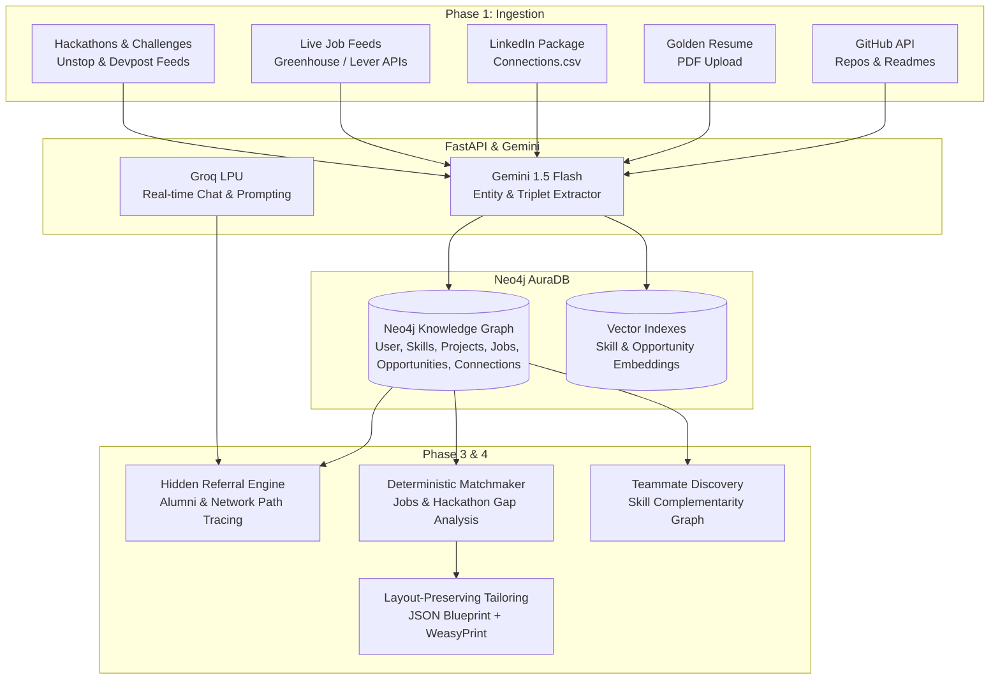

# CareerOS (GraphPaths AI) 🚀
### AI-Powered, GraphRAG Career Navigation & Hidden Referral Engine

[](https://fastapi.tiangolo.com)
[](https://react.dev)
[](https://neo4j.com/cloud/platform/aura-graph-database/)
[](https://supabase.com)
[](https://aistudio.google.com)
[](https://groq.com)
[](docs/ARCHITECTURE.md)

---

## 🌟 Overview

**CareerOS** is a GraphRAG-powered career intelligence and relationship-aware job search platform. It connects a candidate's complete digital footprint—GitHub repositories, LinkedIn network exports, and a Golden Base Resume—into an interconnected **Knowledge Graph** in Neo4j. 

The platform continuously cross-references your graph against live hiring vacancies and **hackathons/competitions (Unstop, Devpost)**, identifies high-probability **hidden referral paths** (e.g. alumni connections working at hiring companies), discovers **complementary teammates** for challenges, and **hyper-tailors resumes dynamically** using a structural blueprint wizard without breaking user layout.



---

## ⚡ Core Features

- **🕸️ Graph-Native Skill & Experience Modeling:** Replaces flat keyword searches with connected entity nodes `(:User)-[:BUILT]->(:Project)-[:USES_TECH]->(:Skill)`.
- **🤝 Hidden Referral Discovery:** Uncovers multi-hop referral bridges: `(:User)-[:ATTENDED]->(:University)<-[:ATTENDED]-(:Connection)-[:WORKS_AT]->(:Company)-[:POSTED]->(:Job)`.
- **🏆 Hackathon & Hiring Challenge Matching (Unstop, Devpost):** Maps competitive coding challenges and hackathons with direct Pre-Placement Interview (PPI) shortlists, and uses the graph to find university alumni with complementary missing skills for your team.
- **📄 Layout-Preserving Resume Tailoring:** Deconstructs resumes into a strict JSON Blueprint schema. Only targeted bullet points are rewritten (STAR format) and compiled via WeasyPrint into identical, ATS-friendly PDFs.
- **⚡ 100% Free Tier Architecture:** Engineered with deterministic pipelines (no expensive open-ended agents) using Neo4j AuraDB, Supabase, Google AI Studio, Groq, and FastAPI on Render/Vercel.

---

## 📚 Complete Documentation Index

| Document | Description |
| :--- | :--- |
| 🏗️ [**Architecture Guide**](docs/ARCHITECTURE.md) | Full technical stack, system components, free-tier limits, data flows, and security model. |
| ⛓️ [**Data Pipeline Guide**](docs/DATA_PIPELINE.md) | In-depth breakdown of Phase 1 (Ingestion), Phase 2 (KG Construction), Phase 3 (Matchmaking), and Phase 4 (Resume Engine). |
| 📊 [**Graph Schema & Cypher Queries**](docs/GRAPH_SCHEMA.md) | Neo4j AuraDB schema definitions, node constraints, relationship types, and query templates. |
| 🔌 [**API Specification**](docs/API_SPECIFICATION.md) | FastAPI REST endpoints, OpenAPI schemas, request/response models, and Supabase Auth integration. |
| 🛠️ [**Setup & Deployment Guide**](docs/SETUP_GUIDE.md) | Step-by-step local development setup, environment variables, Supabase config, and cloud deployment guides. |

---

## 🏗️ Technical Stack Breakdown

| Component | Technology | Free Tier Provider | Role |
| :--- | :--- | :--- | :--- |
| **Frontend** | React 18, Vite, TailwindCSS, Lucide Icons | [Vercel](https://vercel.com) | Interactive dashboard, split-screen blueprint editor, graph visualizer |
| **Backend** | Python 3.11, FastAPI, Pydantic v2, Uvicorn | [Render](https://render.com) / [Koyeb](https://koyeb.com) | Ingestion workers, Cypher query orchestration, PDF compiler |
| **Graph DB** | Neo4j AuraDB Free (200k nodes / 400k rels) | [Neo4j Aura](https://neo4j.com/cloud/aura/) | Entity relationships, multi-hop referral traversal, vector indexing |
| **Auth & Storage** | Supabase (PostgreSQL + S3 Storage) | [Supabase](https://supabase.com) | User Auth (JWT/OAuth), raw resume PDF storage bucket |
| **Document AI** | Google Gemini 1.5 Flash (1M token window) | [Google AI Studio](https://aistudio.google.com) | High-throughput structured JSON extraction, resume parsing |
| **Fast LLM Chat** | Llama-3.3-70b-versatile via Groq API | [Groq Cloud](https://console.groq.com) | Sub-second candidate Q&A and outreach email generation |
| **PDF Generation**| WeasyPrint / Jinja2 HTML Templates | Embedded Backend Utility | Pixel-perfect ATS PDF document rendering |

---

## 🚀 Quick Start (Local Development)

### 1. Clone & Setup Environment
```bash
git clone https://github.com/your-username/careerOS.git
cd careerOS
cp .env.example .env
```

### 2. Backend Setup
```bash
cd backend
python3 -m venv venv
source venv/bin/activate
pip install -r requirements.txt
uvicorn app.main:app --reload --port 8000
```

### 3. Frontend Setup
```bash
cd ../frontend
npm install
npm run dev -- --port 3000
```

Access API docs at `http://localhost:8000/docs` and Dashboard at `http://localhost:3000`.

---

## 📂 Project Structure

```
careerOS/
├── README.md
├── .env.example
├── docs/
│   ├── ARCHITECTURE.md
│   ├── DATA_PIPELINE.md
│   ├── GRAPH_SCHEMA.md
│   ├── API_SPECIFICATION.md
│   └── SETUP_GUIDE.md
├── backend/
│   ├── app/
│   │   ├── main.py
│   │   ├── core/
│   │   │   ├── config.py
│   │   │   ├── database.py
│   │   │   └── security.py
│   │   ├── api/
│   │   │   ├── v1/
│   │   │   │   ├── auth.py
│   │   │   │   ├── ingest.py
│   │   │   │   ├── graph.py
│   │   │   │   ├── referrals.py
│   │   │   │   ├── jobs.py
│   │   │   │   └── resume.py
│   │   ├── services/
│   │   │   ├── github_service.py
│   │   │   ├── linkedin_service.py
│   │   │   ├── gemini_extractor.py
│   │   │   ├── neo4j_service.py
│   │   │   ├── job_tracker_service.py
│   │   │   └── resume_compiler.py
│   │   └── schemas/
│   │       ├── graph_models.py
│   │       ├── resume_blueprint.py
│   │       └── job_models.py
│   ├── requirements.txt
│   └── Dockerfile
└── frontend/
    ├── src/
    │   ├── components/
    │   ├── pages/
    │   ├── hooks/
    │   ├── services/
    │   └── App.jsx
    ├── package.json
    ├── tailwind.config.js
    └── vite.config.js
```

---

## 🛡️ License

Distributed under the MIT License. See `LICENSE` for details.
