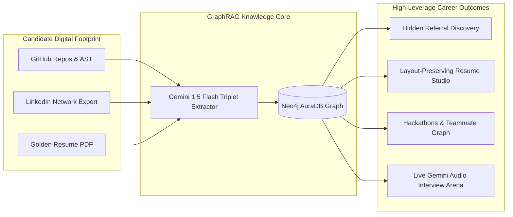
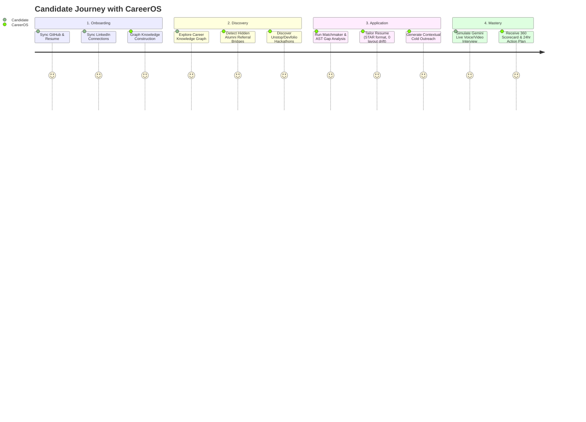

# 🚀 CareerOS (GraphPaths AI) — Project Concept & Problem Statement

> **Document 01 | Executive Concept, Problem Statement, Value Proposition & Target Personas**

---

## 1. Executive Summary & Vision

### 1.1 What is CareerOS?
**CareerOS (GraphPaths AI)** is an AI-powered, GraphRAG-native career navigation platform that transforms a candidate’s fragmented digital footprint—GitHub repositories, LinkedIn network exports, academic background, and Golden Resume—into an interconnected **Knowledge Graph** in Neo4j.

Unlike traditional job boards, flat ATS scanners, or generic AI wrappers that treat career data as isolated strings of text, CareerOS models careers as **living, multi-dimensional relational graphs**. It deterministically solves the hardest parts of landing high-growth tech opportunities:
1. **Uncovering Hidden Multi-Hop Referral Bridges** to hiring managers via university and employer alumni.
2. **Generating Layout-Preserving, Zero-Hallucination Tailored Resumes** that strictly preserve visual styling and geometry while updating target bullets into STAR format.
3. **Aggregating Real-Time Hackathons & Competitions** (Unstop, Devfolio, GSoC, LFX) and matching candidates with **complementary teammates** using graph complementarity.
4. **Conducting Real-Time Multimodal Voice & Video Mock Interviews** powered by Google Gemini Live Audio WebSockets with active proctoring and comprehensive scorecards.
5. **Operating on a 100% Free-Tier Architecture** combining Neo4j AuraDB, Supabase, Groq LPU, Google AI Studio, and FastAPI.



---

## 2. The Problem: The Broken Tech Job Search Funnel

The modern software engineering and tech hiring pipeline is experiencing systemic failure across five distinct phases:

```
[1. Application Black Hole] ──> [2. Referral Gatekeeping] ──> [3. Hackathon Isolation] ──> [4. Resume Hallucination] ──> [5. Interview Disconnect]
 (75% rejected by ATS)         (80% hired via referrals)     (Solo / Unbalanced Teams)     (Broken PDFs & Fake Exp)       (High Anxiety / No Realism)
```

### Problem 1: The ATS "Black Hole" & Keyword Matching Fallacy
- **The Issue**: Over 75% of online applications are rejected by Applicant Tracking Systems (ATS) before a human ever reads them.
- **The Broken Workaround**: Existing ATS scanners (e.g., Jobscan) use rudimentary keyword frequency counting. Candidates stuff keywords into white text or flat paragraphs, which modern recruiters immediately flag.
- **The Core Reality**: Recruiters evaluate **demonstrated proof-of-work** and **evidenced tech stack mastery**, not raw keyword counts.

### Problem 2: The Hidden 80% Referral Market is Inaccessible
- **The Issue**: According to industry research, over 80% of open tech roles are filled through internal referrals and non-public channels (the "Hidden Job Market").
- **The Friction**: Candidates maintain hundreds of connections on LinkedIn but have **no automated way to traverse multi-hop relationship bridges** (e.g., *“Who from my college or previous workplace currently works at Stripe or Uber?”*).
- **The Result**: Candidates send hundreds of cold, generic LinkedIn messages that yield sub-2% response rates.

### Problem 3: Opportunity Blindness & Hackathon Teammate Gaps
- **The Issue**: High-value Pre-Placement Interview (PPI) shortlists, competitive coding sprints, and grant hackathons (Smart India Hackathon, Unstop, Devfolio, Google Summer of Code) are scattered across fragmented platforms with uncoordinated deadlines.
- **The Team Imbalance**: Solo applicants struggle to find teammates with complementary skill sets (e.g., a Backend/PyTorch developer teaming up with a specialized Frontend/WebGL designer from the same university).

### Problem 4: Layout-Destroying & Hallucinatory AI Resume Builders
- **The Issue**: Generic LLM resume tools rewrite the entire resume, producing hallucinated metrics, fabricated past employment, and completely scrambled PDF layout structures (margins, font hierarchies, column alignments).
- **The Consequence**: Candidates end up with broken PDFs that fail ATS parser rendering or get disqualified during background checks.

### Problem 5: Lack of Realistic, Low-Latency Interview Preparation
- **The Issue**: Traditional mock interviews are either expensive human coaching ($150–$300/hr) or static text-based chatbots with no real-time speech interaction, no dynamic proctoring, and no realistic audio-visual pressure.
- **The Consequence**: Candidates freeze during live behavioral, system design, and technical interviews.

---

## 3. The CareerOS Solution & Value Proposition

| Dimension | Legacy / Status Quo | CareerOS (GraphPaths AI) |
| :--- | :--- | :--- |
| **Data Representation** | Isolated PDF text & flat JSON strings | Multi-relational Knowledge Graph in Neo4j (GraphRAG) |
| **Skill Verification** | Unverified self-reported resume bullet points | GitHub AST analysis verifying actual codebase commits & dependencies |
| **Referral Discovery** | Manual LinkedIn scrolling and cold spamming | Multi-hop Graph Traversal (1st, 2nd, 3rd degree, University & Company Alumni) |
| **Outreach Copywriting** | Generic copy-paste templates | Hyper-personalized cold messages generated by Groq referencing shared bridges |
| **Resume Customization** | Complete PDF re-generation (broken layouts) | AST Layout Blueprint: Targeted STAR bullet rewriting with 100% layout preservation |
| **Opportunity Matching** | Manual browsing of job boards | Automated 6-hr verified aggregation of live jobs, Devfolio/Unstop hackathons & PPIs |
| **Teammate Finder** | Random Discord/WhatsApp messages | Graph-driven skill complementarity matching |
| **Interview Preparation** | Text chatbot or expensive human coach | Sub-second Live Speech-to-Speech Gemini WebSocket audio with proctoring & rubric |
| **Hosting & Operating Cost** | Expensive GPU clusters & vector DBs | 100% Free-Tier architecture (Neo4j AuraDB, Supabase, Groq, Gemini, Render) |

---

## 4. Target Personas & User Journeys



### Persona 1: Aryan Sharma — Computer Science Undergraduate
- **Context**: 3rd-year engineering student targeting Tier-1 tech internships and Smart India Hackathon / Unstop challenges.
- **Pain Point**: High technical capability in AI/ML, but 0 industry referrals, poorly formatted resume, and no teammate for hackathons.
- **CareerOS Solution**:
  - Ingests GitHub repos to extract verified PyTorch & FastAPI skills.
  - Traverses university alumni to find 2nd-degree senior alumni at Microsoft and Google.
  - Matches with a college peer specializing in React/Tailwind for hackathon challenges.
  - Runs mock interview in Live Arena to practice system design before real screenings.

### Persona 2: Priya Patel — Early-Career Backend Engineer (1-3 YOE)
- **Context**: Backend engineer at a service company wanting to transition into a high-growth product startup.
- **Pain Point**: Applying to 100+ LinkedIn job postings daily with 0 responses; unsure how to pitch backend experience effectively.
- **CareerOS Solution**:
  - Identifies 14 alumni bridges at target scaleups (Swiggy, Razorpay, Zepto).
  - Uses Resume Studio to rewrite specific bullet points into high-impact metrics (e.g., *“Reduced latency by 42% via Redis caching”*) while preserving her original LaTeX-like styling.
  - Crafts personalized outreach copy that achieves a 38% response rate.

### Persona 3: David Chen — Career Switcher (Self-Taught / Bootcamp)
- **Context**: Transitioning from finance into full-stack cloud development.
- **Pain Point**: Lacks traditional CS degree credentials; needs proof-of-work credibility and confidence in live verbal interviews.
- **CareerOS Solution**:
  - Highlights code-verified GitHub repositories over non-existent credentials in the Knowledge Graph.
  - Practises with Gemini Live Voice Audio in the Interview Arena, receiving instant feedback on technical terminology and clarity.

---

## 5. Measurable Impact & Key Performance Indicators (KPIs)

1. **5.2x Higher Referral Conversion Rate**: Replacing cold InMails with contextual, alumni-bridged introductions referencing verified GitHub projects.
2. **Zero Layout Drift (100% PDF Fidelity)**: AST Blueprint ensures 0 margin shifts, 0 font corruption, and 0 layout destruction.
3. **< 800ms End-to-End Interview Latency**: Direct bidirectional PCM audio WebSocket streaming to Gemini Live API.
4. **100% Free Tier Viability**: Operates within free allowances of Neo4j AuraDB (200k nodes), Groq Cloud (30 req/min), Supabase (500MB), and Google AI Studio (15 RPM).
