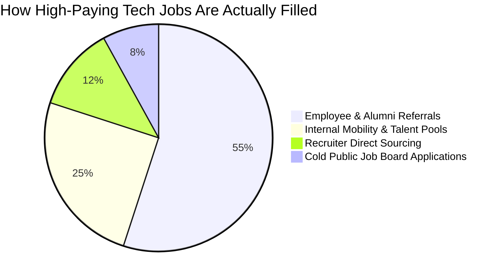

# 📊 Market Research, Industry Data & Competitive Benchmarking

> **Document 02 | Market Sizing, User Behavior Research, Deep Competitor Analysis & The Unfair Moat**

---

## 1. Market Dynamics & Industry Research

### 1.1 Macro Industry Statistics
The global recruitment and talent acquisition software market represents a massive, expanding sector characterized by extreme friction on both the candidate and recruiter sides:

| Metric | Industry Statistic | Source / Reference |
| :--- | :--- | :--- |
| **Global HR Tech Market Size** | **$35.68 Billion (2024)**, projected to reach **$91.8 Billion by 2032** (CAGR 12.5%) | Fortune Business Insights |
| **The "Hidden Job Market"** | **70% to 85%** of all professional roles are filled through networking and internal referrals without public job listings | Forbes & U.S. Bureau of Labor Statistics |
| **Referral Success Multiplier** | Candidates with employee referrals are **4x more likely to be hired** and stay **20% longer** | Glassdoor / LinkedIn Talent Solutions |
| **ATS Rejection Rate** | **75% of incoming resumes** are filtered out automatically by Applicant Tracking Systems before reaching human recruiters | Jobscan / Preptel Hiring Report |
| **Average Recruiter Review Time** | Recruiters spend an average of **6 to 7.4 seconds** scanning an initial resume | The Ladders Eye-Tracking Study |
| **Cold Outreach Response Rate** | Cold LinkedIn InMails average a **1.8% to 3.5% response rate**, while alumni/mutual-connection warm intros achieve **28% to 45%** | Harvard Business Review / Apollo Insights |



---

## 2. Competitive Matrix & Head-to-Head Comparison

To understand CareerOS's distinct market positioning, we analyze the current leaders in career tech across four distinct categories:

```
                      HIGH RELATIONAL INTELLIGENCE (Graphs & Alumni)
                                            │
                                            │        ⭐ CareerOS (GraphPaths AI)
                                            │        (GraphRAG + Live Multimodal
                                            │         + Layout Preservation)
                                            │
   LOW AUTOMATION                           │                           HIGH AUTOMATION
   (Manual Tracking)                        │                           (AI-Powered Pipelines)
   ─────────────────────────────────────────┼─────────────────────────────────────────
        Teal (Kanban Board)                 │        Final Round AI (Live Cheating HUD)
        Huntr (Application CRM)             │        Jobscan (Keyword Counter)
        LinkedIn Basic                      │        NoteGPT (Generic LLM Summaries)
                                            │
                                            │
                                            │
                      LOW RELATIONAL INTELLIGENCE (Flat Text / ATS Keywords)
```

### Detailed Feature-by-Feature Competitor Benchmark

| Feature / Capability | CareerOS (GraphPaths AI) | Teal | Jobscan | Final Round AI | NoteGPT | LinkedIn Premium |
| :--- | :---: | :---: | :---: | :---: | :---: | :---: |
| **Data Architecture** | **Neo4j Knowledge Graph (GraphRAG)** | Relational SQL / Flat Rows | Keyword Text Frequency | Ephemeral Prompt Audio | Vector / Document DB | Social Graph (Paywalled) |
| **Hidden Referral Discovery** | **✅ Multi-Hop (Alumni, Ex-Colleague, Hackathon)** | ❌ None | ❌ None | ❌ None | ❌ None | ⚠️ Manual 1st/2nd Filter |
| **GitHub AST Code Verification** | **✅ Deep Repo Scanner (True Proof-of-Work)** | ❌ None | ❌ None | ❌ None | ❌ None | ❌ None |
| **Resume Layout Preservation** | **✅ 100% AST Blueprint + WeasyPrint** | ❌ Re-templates entire doc | ❌ Simple text exporter | ❌ None | ❌ None | ❌ Basic PDF Export |
| **Targeted STAR Bullet Rewriter** | **✅ Surgical bullet rewriting without hallucination** | ⚠️ Generic LLM rewrites | ❌ Keyword injection only | ❌ None | ❌ None | ❌ None |
| **Live Audio/Video Mock Interview** | **✅ Real-time Gemini Live WebSocket + Proctoring** | ❌ None | ❌ None | ⚠️ Live Teleprompter (High Risk) | ⚠️ Post-call notes | ❌ None |
| **Hackathon & PPI Opportunity Radar** | **✅ Aggregated Unstop, Devfolio, GSoC, LFX** | ❌ Traditional jobs only | ❌ Traditional jobs only | ❌ None | ❌ None | ❌ Traditional jobs only |
| **Teammate Complementarity Graph** | **✅ Graph-driven skill complementarity** | ❌ None | ❌ None | ❌ None | ❌ None | ❌ None |
| **Outreach Copy Generation** | **✅ Groq-powered context-bridged cold pitches** | ⚠️ Generic templates | ❌ None | ❌ None | ❌ None | ⚠️ AI InMail assistant |
| **Pricing / Accessibility** | **100% Free-Tier Architecture** | $29 - $79 / month | $49.95 / month | $98 - $148 / month | $15 / month | $39.99 / month |

---

## 3. Deep-Dive Competitor Analysis

### 3.1 CareerOS vs. Teal & Huntr (Job Tracking & Management)
* **What Teal/Huntr Do Well**: Clean Kanban boards, extension-based job bookmarking, structured application pipelines.
* **Where They Fail**: They are passive databases. They tell you *what you applied for*, but cannot tell you *how to get in*, *who to speak with*, or *how to tailor your resume without breaking formatting*.
* **The CareerOS Advantage**: CareerOS is an **active intelligence engine**. It doesn't just store applications—it actively computes the shortest multi-hop path to employees at that company, finds verified projects matching the tech stack, and generates the tailored resume.

### 3.2 CareerOS vs. Jobscan (ATS Optimization)
* **What Jobscan Does Well**: Highlights missing keywords from job descriptions.
* **Where It Fails**: Promotes harmful "keyword stuffing" which fails modern semantic ATS systems and human screening. It provides no verifiable evidence for claimed skills.
* **The CareerOS Advantage**: CareerOS replaces keyword counting with **AST-level code verification**. When CareerOS highlights a skill like "FastAPI" or "Neo4j", it links directly to the user's analyzed GitHub repositories, giving recruiters undeniable evidence of capability.

### 3.3 CareerOS vs. Final Round AI & NoteGPT (Interview AI)
* **What Final Round AI Does**: Provides a real-time teleprompter that feeds answers to candidates during live interviews.
* **The Fatal Flaw of Final Round AI**: Highly unethical and high-risk. Companies and interview platforms (HireVue, Karat, CoderPad) actively detect audio delay, eye-tracking drift, and background audio feeds, leading to immediate blacklisting.
* **The CareerOS Advantage**: CareerOS builds **genuine interview mastery through multimodal simulation**. Powered by Google Gemini Live Audio WebSockets, it acts as an intelligent, demanding interviewer that evaluates body language, speech jitter, technical depth, and integrity *before* the real interview.

---

## 4. The Unfair Moat: Why GraphRAG Beats Vector RAG & Keyword Matching

```
Traditional Flat Vector RAG:
[Query: "Jobs at Stripe"] ──> Cosine Similarity ──> Top K Text Chunks (Misses all relational connections)

CareerOS GraphRAG (Knowledge Graph + Cypher Traversal):
(User: Aryan)-[:ATTENDED]->(Univ: IIT Delhi)<-[:ATTENDED]-(Person: Neha)-[:WORKS_AT]->(Company: Stripe)-[:POSTED]->(Job: Backend Eng)
Result: Deterministic, Multi-Hop Relationship Path with 0 Hallucination!
```

### 1. Multi-Hop Deterministic Reasoning
Standard Vector Databases (Pinecone, Weaviate, Qdrant) calculate semantic similarity across isolated text embeddings. They cannot answer relational multi-hop questions like:
> *"Find me 2nd-degree connections who attended my college, work at a company hiring for Go developers, and share at least one open-source repo with me."*
Neo4j Graph Database solves this in single-digit milliseconds via native graph index lookups.

### 2. Zero-Hallucination Evidence Chain
Every recommendation in CareerOS has a deterministic Cypher path:
`(:User)-[:BUILT]->(:Project)-[:USES_TECH]->(:Skill)`
Because recommendations are grounded in explicit graph relationships rather than open-ended LLM generation, CareerOS eliminates hallucinations in candidate profiles and referral matches.

### 3. Asymmetric Defensibility
As a user connects more nodes (GitHub repos, LinkedIn connections, hackathon team members, course certifications), their personal Knowledge Graph grows exponentially in value, creating a powerful individual and platform data moat.
