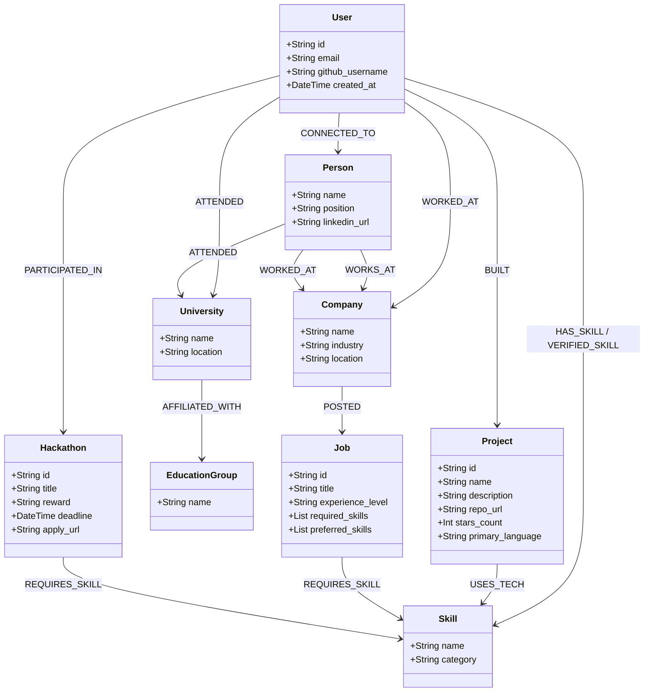

# 🏗️ System Architecture, Data Pipelines & Technical Stack

> **Document 03 | High-Level & Low-Level Architecture, Graph Schema, Multi-Hop Pipelines & Free-Tier Optimization**

---

## 1. End-to-End System Architecture

CareerOS is built using a modern, decoupled micro-modular architecture designed for sub-second latency, deterministic GraphRAG execution, and strict cost efficiency.

```mermaid
graph TD
    subgraph Client_Layer [Client & Edge Layer]
        WEB[React 18 + Vite Web App<br/>TailwindCSS / Lucide]
        EXT[Chrome MV3 Extension<br/>DOM Scraper & Job Syncer]
        LIVE_CLIENT[Live Interview WebRTC/WS<br/>PCM 16/24kHz Audio Streamer]
    end

    subgraph API_Gateway [FastAPI Gateway & Auth]
        ROUTER[FastAPI v5.0 Gateway<br/>Asynchronous Non-blocking IO]
        AUTH[Supabase Auth & JWT Validator]
        KEEPALIVE[Self-Ping Keep-Alive Worker<br/>Eliminates Free-Tier Cold Starts]
    end

    subgraph AI_Inference [AI & LLM Services]
        GEMINI_EXP[Google Gemini 1.5 Flash<br/>JSON Extraction & Resume Parser]
        GEMINI_LIVE[Google Gemini Live Audio WS<br/>Speech-to-Speech Realtime Interviewer]
        GROQ_LPU[Groq LPU (Llama-3.3-70b)<br/>Sub-second Outreach & Chat]
    end

    subgraph Knowledge_Data [Knowledge & Data Layer]
        NEO4J[(Neo4j AuraDB Free<br/>Graph Engine & Cypher Traversal)]
        SUPA_DB[(Supabase PostgreSQL<br/>Users, Tokens & Metadata)]
        SUPA_S3[(Supabase Storage Bucket<br/>Original PDFs & Assets)]
    end

    subgraph Engines [Core Processing Engines]
        PARSER[AST Code & Doc Parser<br/>GitHub API + PyPDF2]
        MATCHER[Graph Deterministic Matchmaker<br/>Skill Gaps & Multi-hop Paths]
        WEASY[WeasyPrint PDF Engine<br/>Pixel-Perfect Layout-Preserving]
        RADAR_SERVICE[Live Opportunity Radar<br/>6-Hour Cached Feeds Scraper]
    end

    WEB & EXT & LIVE_CLIENT --> ROUTER
    ROUTER --> AUTH
    ROUTER --> PARSER
    ROUTER --> MATCHER
    ROUTER --> WEASY
    ROUTER --> RADAR_SERVICE

    PARSER --> GEMINI_EXP
    MATCHER --> GROQ_LPU
    LIVE_CLIENT <--> GEMINI_LIVE

    PARSER --> NEO4J
    MATCHER --> NEO4J
    RADAR_SERVICE --> NEO4J
    AUTH --> SUPA_DB
    WEASY --> SUPA_S3
```

---

## 2. Technical Stack Breakdown & Rationale

| Layer / Component | Technology | Rationale & Selection Criteria | Free-Tier Limits & Efficiency |
| :--- | :--- | :--- | :--- |
| **Frontend UI** | **React 18, Vite, TypeScript, TailwindCSS** | Instant HMR, declarative component state, glassmorphic dark-mode design system, lightweight bundle footprint (<250kB gzip). | Vercel Unlimited Free Hosting |
| **Backend API** | **Python 3.11, FastAPI, Pydantic v2, Uvicorn** | High-concurrency async event loops, automatic OpenAPI docs, native integration with AI/ML libraries and Neo4j async drivers. | Render / Koyeb Free Instances |
| **Graph Database** | **Neo4j AuraDB (Cypher 5)** | Native graph storage engine for multi-hop traversals, relationship indexes, and sub-10ms graph pathfinding. | Free Tier: 200k nodes & 400k relationships |
| **Relational & Storage** | **Supabase (PostgreSQL + S3 Storage)** | Managed user authentication (OAuth/JWT), relational metadata storage, and S3-compatible file storage for resumes. | Free Tier: 500MB DB + 1GB File Storage |
| **Document AI Extraction** | **Google Gemini 1.5 Flash** | 1,000,000 token context window allows ingesting entire codebases and complex multi-page resumes in one structured JSON pass. | Google AI Studio: 15 RPM / 1M TPM Free |
| **Real-time Live Audio** | **Google Gemini Live Audio WebSocket** | Direct bidirectional speech-to-speech audio streaming over WebSockets (PCM 16-bit 24kHz / 16kHz) with built-in tool calling. | Gemini Live Preview Free API Access |
| **Sub-Second LLM Chat** | **Groq Cloud (Llama-3.3-70b-versatile)** | 800+ tokens/sec inference speed enabling instantaneous personalized cold outreach and conversational Graph Brain chats. | Groq Cloud: 30 RPM / 6,000 TPM Free |
| **PDF Compilation** | **WeasyPrint + Jinja2 HTML Templates** | Complies HTML/CSS DOM directly to pixel-perfect, ATS-compliant PDF without headless Chrome memory overhead. | Embedded local Python subprocess (0 cost) |
| **Browser Extension** | **Chrome Extension Manifest V3** | Background service workers and DOM parsers to scrape job specs and recruiter profiles with 1-click sync. | Local browser runtime |

---

## 3. The Neo4j Graph Data Model

The core of CareerOS is its multi-tenant, relational graph schema. Below is the complete entity-relationship model:



### Key Graph Nodes & Relationship Types:
1. `(:User)-[:BUILT]->(:Project)`: Represents verified code projects constructed by the candidate.
2. `(:Project)-[:USES_TECH]->(:Skill)`: Captures AST-level tech stack dependencies used in code repositories.
3. `(:User)-[:VERIFIED_SKILL]->(:Skill)`: Derived relationship created only when a skill is evidenced in actual code (not just self-claimed).
4. `(:User)-[:ATTENDED]->(:University)<-[:ATTENDED]-(:Person)-[:WORKS_AT]->(:Company)`: Represents a **Direct University Alumni Bridge**.
5. `(:University)-[:AFFILIATED_WITH]->(:EducationGroup)<-[:AFFILIATED_WITH]-(:University)`: Enables **Affiliated University Network Bridges** (e.g. state/central university collegiate systems).
6. `(:Person)-[:WORKS_AT]->(:Company)-[:POSTED]->(:Job)`: Identifies internal employees at companies actively hiring.

---

## 4. Multi-Hop Graph Traversal Logic

When a user views a job or pastes a job description, CareerOS runs a multi-layered Cypher query to surface high-probability referral paths:

```cypher
MATCH (u:User {id: $user_id})

// 1. Candidate Context
OPTIONAL MATCH (u)-[:ATTENDED]->(univ:University)
OPTIONAL MATCH (univ)-[:AFFILIATED_WITH]->(grp:EducationGroup)
OPTIONAL MATCH (u)-[:WORKED_AT]->(past_comp:Company)
OPTIONAL MATCH (u)-[:PARTICIPATED_IN]->(hack:Hackathon)

// 2. Target Company Employees
MATCH (p:Person)-[:WORKS_AT]->(c:Company)
WHERE (toLower(c.name) CONTAINS toLower($company) OR toLower($company) CONTAINS toLower(c.name))
  AND p.name IS NOT NULL

// 3. Person Context
OPTIONAL MATCH (p)-[:ATTENDED]->(p_univ:University)
OPTIONAL MATCH (p_univ)-[:AFFILIATED_WITH]->(p_grp:EducationGroup)
OPTIONAL MATCH (p)-[:WORKED_AT]->(p_past_comp:Company)

RETURN DISTINCT p.name AS name,
       p.position AS position,
       c.name AS company,
       coalesce(p_univ.name, 'Alumni Network') AS college,
       CASE 
         WHEN (u)-[:CONNECTED_TO]->(p) THEN '1st Degree Direct Connection'
         WHEN univ IS NOT NULL AND p_univ IS NOT NULL AND univ = p_univ THEN 'Direct University Alumni Bridge'
         WHEN grp IS NOT NULL AND p_grp IS NOT NULL AND grp = p_grp THEN 'University System Alumni Bridge (' + grp.name + ')'
         WHEN past_comp IS NOT NULL AND p_past_comp IS NOT NULL AND past_comp = p_past_comp THEN 'Previous Employer Alumni Bridge'
         ELSE 'Industry Domain Peer'
       END AS bridge_type,
       CASE 
         WHEN (u)-[:CONNECTED_TO]->(p) THEN 98
         WHEN univ IS NOT NULL AND p_univ IS NOT NULL AND univ = p_univ THEN 92
         WHEN grp IS NOT NULL AND p_grp IS NOT NULL AND grp = p_grp THEN 84
         WHEN past_comp IS NOT NULL AND p_past_comp IS NOT NULL AND past_comp = p_past_comp THEN 88
         ELSE 70
       END AS confidence_score
ORDER BY confidence_score DESC
LIMIT 10;
```

---

## 5. Zero-Cost, Self-Healing Infrastructure

```
┌────────────────────────────────────────────────────────┐
│               100% Free-Tier Cloud Ecosystem           │
├───────────────────┬────────────────────────────────────┤
│ Service           │ Optimization Mechanism             │
├───────────────────┼────────────────────────────────────┤
│ FastAPI on Render │ Self-ping worker pings /health     │
│                   │ every 10 min to prevent sleep      │
├───────────────────┼────────────────────────────────────┤
│ Neo4j AuraDB Free │ Multi-tenant scoped node IDs       │
│                   │ within 200,000 node ceiling        │
├───────────────────┼────────────────────────────────────┤
│ Gemini 1.5 Flash  │ Strict JSON extraction schema with │
│                   │ response_format=json_object        │
├───────────────────┼────────────────────────────────────┤
│ Groq LPU          │ 800 tokens/sec high-speed Llama-70B│
│                   │ for instant user-facing chat       │
├───────────────────┼────────────────────────────────────┤
│ WeasyPrint        │ HTML-to-PDF compiled in Python     │
│                   │ memory without Chromium overhead   │
└───────────────────┴────────────────────────────────────┘
```
