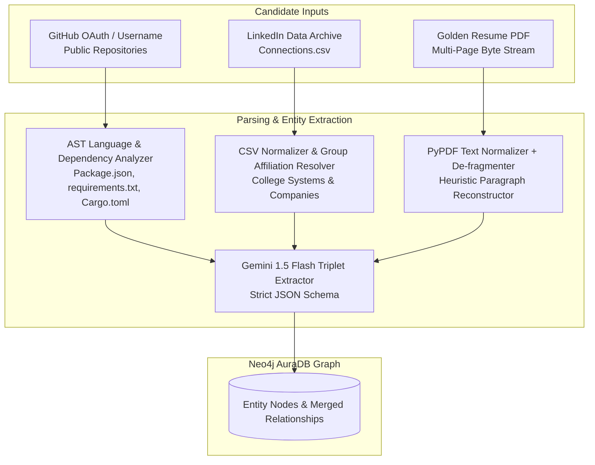
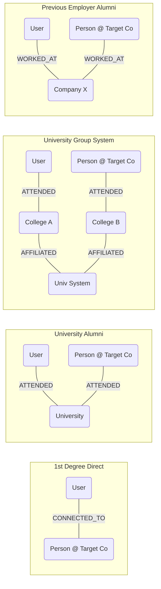
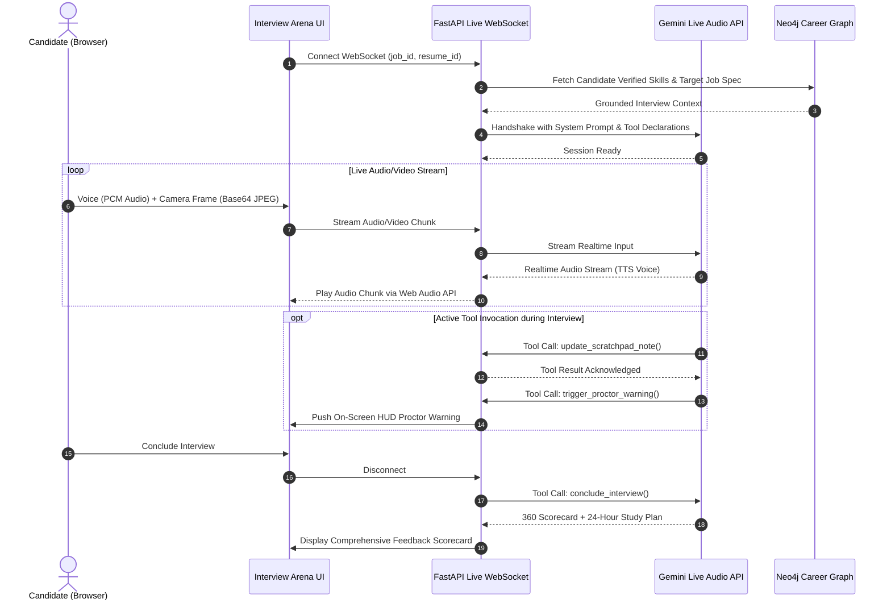

# ⚙️ Detailed Module & Feature Deep Dives

> **Document 04 | In-depth Breakdown of All 7 Core CareerOS Modules & Functionalities**

---

## Module 1: Ingestion Engine & Digital Footprint Parser

### 1.1 Multi-Source Ingestion Architecture
The Ingestion Engine aggregates a candidate's fragmented digital identity into a unified graph schema across three primary ingestion vectors:



### 1.2 Key Sub-Capabilities
1. **GitHub AST Deep Scanner**:
   - Analyzes public repositories, commit volumes, star ratings, and README technical architecture.
   - Inspects dependency files (`package.json`, `requirements.txt`, `go.mod`, `Cargo.toml`) to extract code-verified tech stack nodes: `(:User)-[:BUILT]->(:Project)-[:USES_TECH]->(:Skill)`.
2. **LinkedIn Network Ingestion**:
   - Ingests `Connections.csv` or Chrome Extension synced contacts.
   - Normalizes corporate employer names and educational institutions into canonical graph nodes (`:Person`, `:Company`, `:University`).
3. **Golden Resume PDF Normalization**:
   - Normalizes fragmented PDF character streams (common when PDF extraction drops single words on separate lines).
   - Extracts complete work experience, education, projects, certifications, and awards.

---

## Module 2: Hidden Referral Engine & Alumni Bridge

### 2.1 The Referral Matching Problem
Over 80% of tech hires happen through referrals, yet job seekers typically reach out blindly to strangers with low-conversion cold spam.

### 2.2 Multi-Hop Alumni Bridges
CareerOS computes 5 distinct relationship bridges between the candidate and employees at the hiring company:



### 2.3 Groq-Powered Context-Bridged Outreach Generator
When a user selects a referral bridge, CareerOS invokes Groq LPU (`Llama-3.3-70b-versatile`) to generate high-conversion outreach copy:
- **LinkedIn 300-Character Note**: Crafted specifically for connection request character limits.
- **InMail / Email Pitch**: Contextual message highlighting shared alumni roots, mutual technical stack, and a specific code-verified GitHub project as proof of work.

---

## Module 3: Layout-Preserving Resume Studio

### 3.1 The Problem with Legacy AI Resume Builders
Standard AI resume builders rewrite entire documents from scratch, corrupting PDF margins, fonts, and multi-column geometries, or hallucinating false employment history.

### 3.2 The JSON Blueprint Abstract Syntax Tree (AST)
CareerOS parses the resume into a deterministic `ResumeBlueprint` JSON model:
```json
{
  "header": { "name": "Aryan Sharma", "email": "aryan@example.com", "links": ["github.com/aryan"] },
  "experience": [
    {
      "company": "TechCorp",
      "role": "Backend Engineer",
      "date_range": "2023 - Present",
      "bullets": [
        "Architected distributed microservices in FastAPI and PostgreSQL.",
        "Optimized Redis cache invalidation, cutting p99 query latency by 45%."
      ]
    }
  ],
  "projects": [ ... ],
  "skills": { "languages": ["Python", "Go", "TypeScript"], "frameworks": ["FastAPI", "React"] }
}
```

### 3.3 Targeted STAR Bullet Rewriter
1. **Gap Analysis**: Matches candidate graph against target job description.
2. **Surgical Rewriting**: Modifies *only* the specific bullets relevant to the target role's missing skills using the **STAR** framework (Situation, Task, Action, Result).
3. **WeasyPrint Pixel-Perfect Compilation**: Compiles the blueprint using Jinja2 HTML templates directly into an ATS-compliant PDF with 0 layout drift.
4. **Split-Screen Interactive UI**: Visual side-by-side comparison showing real-time diffs.

---

## Module 4: Opportunities Radar & Hackathon Teammate Matchmaker

### 4.1 Real-Time Verified Opportunity Aggregator
Scrapes and aggregates live opportunities concurrently from:
- **Devfolio API**: Live hackathons with open registration.
- **Unstop API**: Competitive hiring challenges, coding hackathons, and corporate Pre-Placement Interview (PPI) tracks.
- **Jobicy API**: Remote developer job openings across global markets.
- **Flagship Fellowships**: Curated verified tracks including Google Summer of Code (GSoC), Linux Foundation Mentorship (LFX), and Smart India Hackathon (SIH).
- **6-Hour Verified Cache**: Automatically keeps live links fresh while respecting external rate limits.

### 4.2 Teammate Skill Complementarity Graph
When preparing for a hackathon, CareerOS queries the candidate's university and network graph to identify peers whose skill sets complement the user:
- If the user has high scores in **Backend / PyTorch / Docker**, the graph identifies connections specializing in **Frontend / Three.js / Mobile**.

---

## Module 5: Live Multimodal Interview Arena (Gemini Live Audio)

### 5.1 Architecture & Low-Latency Audio Streaming
The Live Interview Arena connects directly to the **Google Gemini Live API** via bidirectional WebSockets, streaming raw PCM 16-bit audio (24kHz / 16kHz) for low-latency voice-to-voice conversation.



### 5.2 Real-time Active Tools & Dynamic Proctoring
The Gemini Live agent has access to real-time function calling tools:
1. `update_scratchpad_note`: Records private observations on technical depth, speech confidence, problem-solving structure, and communication clarity.
2. `trigger_proctor_warning`: Detects suspicious behavior (phone in frame, looking away, multiple voices) and delivers a polite verbal caution and visual HUD alert.
3. `terminate_interview_early`: Ends the session if integrity violations exceed thresholds.
4. `conclude_interview`: Generates a comprehensive 360-degree scorecard, complete with technical ratings, behavioral metrics, and an actionable 24-hour study plan.

---

## Module 6: Career Brain Chat & Benchmark Lab

### 6.1 Career Brain Chat (Graph-Grounded Copilot)
An interactive AI assistant grounded in the user's Neo4j Knowledge Graph. Users can query natural language questions:
- *"Which companies where my college alumni work are hiring for Rust or Go?"*
- *"What projects on my GitHub best prove my distributed systems knowledge?"*
- *"What skills am I missing to apply for a Senior Full-Stack role at Swiggy?"*

### 6.2 Benchmark Lab
- Calculates percentile rankings for the user's technical competencies against global developer benchmarks.
- Provides market compensation insights and identifies high-ROI skills to learn next based on current hiring demand.

---

## Module 7: Chrome Extension Ecosystem

### 7.1 Single-Click Job & Recruiter Ingestion
Built on **Chrome Extension Manifest V3**:
- Injects non-intrusive action buttons on LinkedIn job postings, Indeed listings, and company career portals.
- Extracts company name, job title, description text, and recruiter profile in 1 click.
- Syncs directly to the user's CareerOS backend API, triggering instant match score calculation, referral bridge detection, and resume tailoring.
