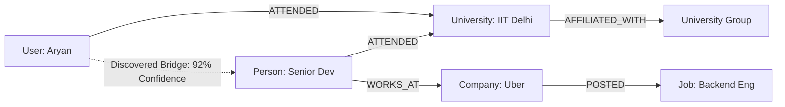
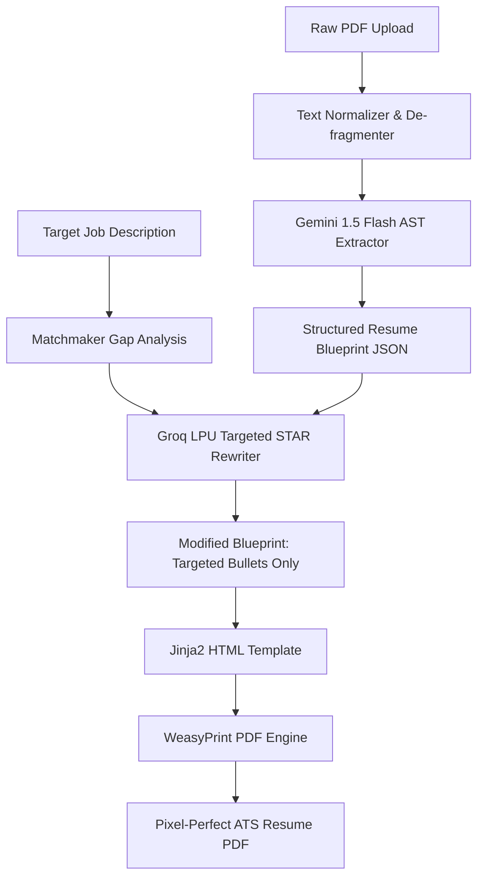

# 💻 Source Code Architecture & Algorithmic Explanation

> **Document 05 | Key Algorithms, Core Implementation Files, Code Walkthrough & Jury Defense Reference**

---

## 1. Codebase Directory Mapping

```
careerOS-v5/
├── backend/                                # FastAPI 5.0 High-Concurrency Async Backend
│   ├── app/
│   │   ├── main.py                         # Gateway, CORS, Lifespan, Keep-Alive Worker
│   │   ├── core/
│   │   │   ├── config.py                   # Pydantic Settings & Environment Parsing
│   │   │   ├── database.py                 # Async Neo4j Driver & Connection Pool
│   │   │   └── security.py                 # JWT Authentication & Multi-Tenant Scoping
│   │   ├── api/v1/                         # REST & WebSocket API Routers
│   │   │   ├── health.py                   # Health Checks & Self-Ping Target
│   │   │   ├── ingest.py                   # GitHub, LinkedIn & Resume Ingestion Endpoints
│   │   │   ├── profile.py                  # Graph Profile & Preference Operations
│   │   │   ├── matches.py                  # Deterministic Matchmaker & Referral APIs
│   │   │   ├── resume.py                   # Layout Blueprint Parsing & PDF Compilation
│   │   │   ├── opportunities.py            # Live Unstop/Devfolio Aggregator & Radar
│   │   │   ├── brain.py                    # Graph-Grounded Natural Language Copilot
│   │   │   └── interview.py                # Gemini Live Audio WebSocket Handler
│   │   ├── services/                       # Business Logic & External Integrations
│   │   │   ├── neo4j_service.py            # Cypher Query Builder & Graph Upserts
│   │   │   ├── gemini_extractor.py         # Triplet & Entity Extraction
│   │   │   ├── gemini_live_service.py      # Realtime Bidirectional WebSocket Engine
│   │   │   ├── resume_service.py           # Text Normalizer, AST Parser & WeasyPrint
│   │   │   ├── matchmaking_service.py      # Graph Gap Analysis & Referral Tracing
│   │   │   ├── opportunities_service.py    # 6-hr Cached Scraper (Devfolio/Unstop/Jobicy)
│   │   │   ├── benchmark_service.py        # Talent Pool Ranking & Market Percentiles
│   │   │   └── llm_service.py              # Groq LPU & Gemini Multi-Provider Facade
│   │   └── schemas/                        # Pydantic Request/Response Models
│   └── requirements.txt                    # Backend Dependencies
├── frontend/                               # React 18 + Vite Frontend Dashboard
│   ├── src/
│   │   ├── App.tsx                         # Main Router & Application Shell
│   │   ├── components/
│   │   │   ├── KnowledgeGraph/             # Interactive D3 / Canvas Graph Visualizer
│   │   │   ├── ReferralHub/                # Multi-Hop Bridge Cards & Outreach Modal
│   │   │   ├── ResumeStudio/               # Split-Screen AST Blueprint & Diff Editor
│   │   │   ├── OpportunitiesRadar/         # Live Hackathon & PPI Tracker
│   │   │   ├── InterviewArena/             # Live Audio/Video WebRTC/WebSocket Arena
│   │   │   ├── BrainChat/                  # Graph-Grounded Conversational Copilot
│   │   │   └── BenchmarkLab/               # Percentile Visualization & Skills Radar
│   │   └── services/                       # Frontend API Connectors
├── live-interview/                         # Standalone High-Speed Interview Engine
└── extension/                              # Chrome Manifest V3 DOM Parser Extension
```

---

## 2. Core Algorithm 1: Multi-Hop Referral Discovery Engine

### Location: `backend/app/services/matchmaking_service.py` & `neo4j_service.py`

### Algorithmic Concept
Computes deterministic multi-degree relationship paths connecting the candidate `(:User)` to target company employees `(:Person)-[:WORKS_AT]->(:Company)` by evaluating 5 distinct relationship layers in a single atomic Cypher execution.



### Implementation Excerpt:
```python
# Multi-Source Referral Cypher Query
referral_query = """
MATCH (u:User {id: $user_id})

// 1. User Context (College, Group, Past Companies, Hackathons)
OPTIONAL MATCH (u)-[:ATTENDED]->(univ:University)
OPTIONAL MATCH (univ)-[:AFFILIATED_WITH]->(grp:EducationGroup)
OPTIONAL MATCH (u)-[:WORKED_AT]->(past_comp:Company)

// 2. Target Company Employees
MATCH (p:Person)-[:WORKS_AT]->(c:Company)
WHERE (toLower(c.name) CONTAINS toLower($company) OR toLower($company) CONTAINS toLower(c.name))
  AND p.name IS NOT NULL

// 3. Employee Educational & Career Context
OPTIONAL MATCH (p)-[:ATTENDED]->(p_univ:University)
OPTIONAL MATCH (p_univ)-[:AFFILIATED_WITH]->(p_grp:EducationGroup)
OPTIONAL MATCH (p)-[:WORKED_AT]->(p_past_comp:Company)

RETURN DISTINCT p.name AS name,
       p.position AS position,
       c.name AS company,
       coalesce(p_univ.name, 'Alumni Network') AS college,
       CASE 
         WHEN (u)-[:CONNECTED_TO]->(p) THEN '1st Degree Direct Connection'
         WHEN univ IS NOT NULL AND p_univ IS NOT NULL AND univ = p_univ THEN 'Direct University Alumni Bridge'
         WHEN grp IS NOT NULL AND p_grp IS NOT NULL AND grp = p_grp THEN 'University System Alumni Bridge (' + grp.name + ')'
         WHEN past_comp IS NOT NULL AND p_past_comp IS NOT NULL AND past_comp = p_past_comp THEN 'Previous Employer Alumni Bridge'
         ELSE 'Industry Domain Peer'
       END AS bridge_type,
       CASE 
         WHEN (u)-[:CONNECTED_TO]->(p) THEN 98
         WHEN univ IS NOT NULL AND p_univ IS NOT NULL AND univ = p_univ THEN 92
         WHEN grp IS NOT NULL AND p_grp IS NOT NULL AND grp = p_grp THEN 84
         WHEN past_comp IS NOT NULL AND p_past_comp IS NOT NULL AND past_comp = p_past_comp THEN 88
         ELSE 70
       END AS confidence_score
ORDER BY confidence_score DESC
LIMIT 10;
"""
```

---

## 3. Core Algorithm 2: Layout-Preserving AST Resume Normalizer & Compiler

### Location: `backend/app/services/resume_service.py`

### Algorithmic Concept
1. **Line Stream De-fragmentation**: Reassembles fragmented character streams emitted by PDF parsers into coherent paragraphs while preserving structural headings and bullet markers.
2. **AST Blueprint Parsing**: Converts text into a strongly typed `ResumeBlueprint` schema via Gemini 1.5 Flash.
3. **Surgical Bullet Rewriting**: Employs Groq LPU with targeted STAR prompts on *only* the specific bullets addressing the job description gap.
4. **WeasyPrint Compilation**: Compiles the blueprint to an ATS PDF via Jinja2 HTML templates without touching document margins or font metrics.



---

## 4. Core Algorithm 3: Low-Latency Bidirectional Gemini Live WebSocket Protocol

### Location: `backend/app/services/gemini_live_service.py`

### Algorithmic Concept
Establishes a continuous, duplex WebSocket pipeline between the browser and Google Gemini Live API. It streams raw PCM 16-bit audio chunks (24kHz / 16kHz) and video frames with active tool executions (`update_scratchpad_note`, `trigger_proctor_warning`, `conclude_interview`).

```python
# Gemini Live Session Configuration & Tool Binding
async def start_live_session(self, websocket: WebSocket, candidate_context: Dict[str, Any]):
    config = types.LiveConnectConfig(
        response_modalities=[types.LiveServerContentModality.AUDIO],
        speech_config=types.SpeechConfig(
            voice_config=types.VoiceConfig(
                prebuilt_voice_config=types.PrebuiltVoiceConfig(voice_name="Aoede")
            )
        ),
        system_instruction=types.Content(
            parts=[types.Part.from_text(
                f"You are an elite, highly demanding Lead Technical Interviewer conducting a mock interview for {candidate_context.get('job_title')}.\n"
                f"Candidate Verified Tech Stack: {candidate_context.get('verified_skills')}\n"
                "Evaluate problem solving, technical depth, and communication. Actively take notes and trigger proctor warnings if necessary."
            )]
        ),
        tools=[types.Tool(function_declarations=INTERVIEWER_LIVE_TOOLS)]
    )
    
    async with self.client.aio.live.connect(model="gemini-2.0-flash-exp", config=config) as session:
        # Concurrent async tasks: receive from browser -> forward to Gemini, receive from Gemini -> stream to browser
        await asyncio.gather(
            self._stream_client_to_gemini(websocket, session),
            self._stream_gemini_to_client(websocket, session)
        )
```

---

## 5. Core Algorithm 4: Self-Healing Keep-Alive Cloud Worker

### Location: `backend/app/main.py`

### Algorithmic Concept
To prevent free-tier cloud containers (Render, Koyeb) from sleeping and incurring 50-second cold start delays, a background async task runs on the FastAPI event loop, delivering a self-ping to `/api/v1/health` every 10 minutes.

```python
async def keep_alive_worker():
    """Background worker that prevents cloud containers from entering sleep mode."""
    target_url = settings.KEEP_ALIVE_URL or settings.RENDER_EXTERNAL_URL
    if not target_url:
        return
    health_endpoint = f"{target_url.rstrip('/')}/api/v1/health"
    await asyncio.sleep(60)  # Wait for port binding
    while True:
        try:
            async with httpx.AsyncClient(timeout=15.0) as client:
                await client.get(health_endpoint)
        except Exception as e:
            logger.debug(f"Keep-alive notice: {e}")
        await asyncio.sleep(settings.KEEP_ALIVE_INTERVAL_SECONDS)
```
