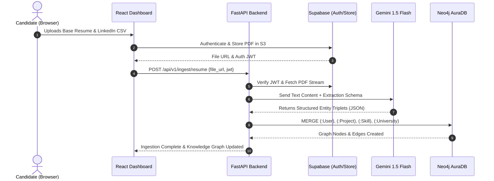

# 🏗️ CareerOS System Architecture

## 1. System Vision & Paradigm

Traditional job application tracking tools rely on flat key-value pairs or document embeddings stored in isolated vector databases. They lack topological awareness of real-world networks—such as company org structures, tech stack dependencies, and university alumni networks.

**CareerOS** introduces a **GraphRAG-powered Career Intelligence Platform** where candidate profiles, code repositories, work experience, alumni relationships, and job descriptions are unified into a high-fidelity **Knowledge Graph (Neo4j)**.

```mermaid
flowchart TB
    subgraph Client [Client Layer (Vercel)]
        UI[React 18 + Vite + TailwindCSS]
        AuthClient[Supabase Auth Client]
    end

    subgraph Edge_API [API & Core Services (Render / Koyeb)]
        API[FastAPI Router Engine]
        JWT[Supabase JWT Validator]
        
        subgraph Pipelines [Deterministic Pipelines]
            GH_Pipe[GitHub Ingestion Pipe]
            PDF_Pipe[Resume Parsing & Blueprint Pipe]
            LI_Pipe[LinkedIn CSV Ingestion Pipe]
            Job_Pipe[Job Boards Poller Pipe]
            Tailor_Engine[STAR Bullet Tailor Engine]
        end
        
        Weasy[WeasyPrint PDF Renderer]
    end

    subgraph AI_Inference [AI Services]
        Gemini[Google Gemini 1.5 Flash<br/>Entity Extraction & STAR Rewriting]
        Groq[Groq LPU Llama-3.3<br/>Low Latency Candidate Outreach]
    end

    subgraph Storage_Cloud [Cloud Storage & Auth]
        SupaDB[(Supabase PostgreSQL)]
        SupaStore[(Supabase Storage: Resumes/Exports)]
    end

    subgraph Graph_Core [Graph Database (Neo4j AuraDB)]
        Neo4j[(Neo4j AuraDB Free Instance<br/>Nodes, Edges, Vector Indexes)]
    end

    UI <--> API
    UI <--> AuthClient
    AuthClient <--> SupaDB
    
    API --> JWT
    JWT --> SupaDB
    API --> SupaStore
    
    API --> Pipelines
    Pipelines <--> Gemini
    Pipelines <--> Groq
    Pipelines <--> Neo4j
    Tailor_Engine --> Weasy
    Weasy --> SupaStore
```

---

## 2. Component Specifications (100% Free Tier Optimized)

### 2.1 Frontend Dashboard (Vercel)
- **Framework**: React 18, Vite, TailwindCSS.
- **State Management**: Zustand / React Query for efficient data caching.
- **Visuals**: `lucide-react` icons, `@visx` / `react-force-graph` for live interactive graph relationship visualizations.
- **Hosting**: Vercel Free Hobby Tier (Unlimited static deployments, automated CI/CD from GitHub).

### 2.2 Backend Application Server (Render / Koyeb)
- **Framework**: Python 3.11 with FastAPI (Asynchronous REST API).
- **Validation**: Pydantic v2 schemas for strict data contract enforcement.
- **Hosting**:
  - **Option A (Render.com)**: Free Web Service (512 MB RAM, spins down on idle).
  - **Option B (Koyeb)**: Free Nano instance (512 MB RAM, always on).
- **Deterministic Workflows**: Replaces non-deterministic agent loops with structured, deterministic state machines and functional pipelines, eliminating hallucination loops and API credit exhaustion.

### 2.3 Knowledge Graph Database (Neo4j AuraDB Free)
- **Instance**: Neo4j AuraDB Free Tier.
- **Capacity**: Up to 200,000 nodes and 400,000 relationships (more than enough for 5,000+ jobs, full user networks, and hundreds of candidate repositories).
- **Capabilities**:
  - Native Cypher Query Engine with graph traversal index lookups.
  - Native Vector Indexing for embedding-based hybrid search.
  - ACID-compliant multi-node transactional updates.

### 2.4 Storage & Authentication (Supabase Free Tier)
- **Authentication**: Supabase Auth (Email/Password, GitHub OAuth, Google OAuth) delivering secure RS256/HS256 JWTs.
- **Storage**: Supabase S3-compatible storage buckets:
  - `resumes/`: Uploaded Golden Base Resumes and compiled tailored PDFs.
  - `linkedin_exports/`: Temporary CSV upload staging.
- **PostgreSQL Database**: Holds auxiliary application states, user preferences, and audit logs.

### 2.5 Dual-Engine AI Inference Layer
1. **Google Gemini 1.5 Flash** (via Google AI Studio Free Tier):
   - **Context Window**: 1,000,000 tokens.
   - **Usage**: High-capacity multi-document parsing (Readmes + whole PDF resumes + lengthy job specs), generating strict JSON output schemas.
   - **Rate Limits**: 15 Requests Per Minute (RPM), 1,500 Requests Per Day (RPD) for free.
2. **Groq LPU (Llama-3.3-70b-versatile)**:
   - **Speed**: ~300 tokens/sec.
   - **Usage**: Real-time interactive referral pitch generation and instant candidate assistance.

---

## 3. Data Flow & Boundary Security



---

## 4. Free-Tier Capacity & Resource Governance

| Resource / Provider | Metric / Free Allowance | Platform Peak Usage per User | Margin of Safety |
| :--- | :--- | :--- | :--- |
| **Neo4j AuraDB** | 200,000 Nodes / 400,000 Relationships | ~2,500 nodes (1 user + 500 connections + 200 jobs) | **80x headroom** |
| **Google AI Studio** | 1,500 requests/day, 1M context tokens | ~30 requests/day (ingest + tailoring runs) | **50x headroom** |
| **Groq Cloud API** | 30 requests/min, 14,400 requests/day | ~10 requests/session | **140x headroom** |
| **Supabase Storage** | 1 GB File Storage | ~2 MB per user (PDFs & CSVs) | **500 user capacity** |
| **Supabase DB** | 500 MB Postgres database | ~50 KB metadata per user | **10,000 user capacity** |
| **Vercel Hosting** | 100 GB Bandwidth / Month | < 500 MB / Month | **200x headroom** |

---

## 5. Security & Privacy Guardrails

1. **Deterministic Processing**: No unbounded background web-crawling or automated spamming bots.
2. **PII Masking**: Candidate contact details and LinkedIn connection emails are strictly isolated; Neo4j stores relationship metadata and IDs rather than raw sensitive personal identifiers.
3. **Scoped Cypher Transactions**: All Cypher queries run with parameterized variables and user tenancy filters (`WHERE user.id = $user_id`), guaranteeing multi-tenant isolation.
4. **JWT Verification**: Every FastAPI route validates Supabase cryptographic JWT claims before database operations.
