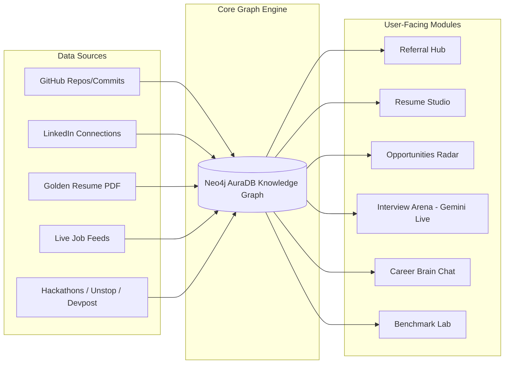

# 🚀 CareerOS (GraphPaths AI) — Feature Blueprint, Demo Playbook & Competitive Analysis

> **Comprehensive System Document**: Features, Live Demonstration Playbook, Deep Competitor Comparison (NoteGPT, Final Round AI, Teal, Jobscan), Moat Analysis, and Roadmap Gaps.

---

## 📑 Table of Contents
1. [Executive Summary & Core Mission](#1-executive-summary--core-mission)
2. [Complete CareerOS Feature Catalog](#2-complete-careeros-feature-catalog)
   - 2.1 Ingestion & Graph Knowledge Engine (GraphRAG)
   - 2.2 Hidden Referral Engine & Alumni Bridge
   - 2.3 Layout-Preserving Resume Studio
   - 2.4 Opportunities Radar & Hackathon Teammate Matchmaker
   - 2.5 Live Interview Arena (Gemini Live Audio & Real-time Evaluation)
   - 2.6 Career Brain Chat & Benchmark Lab
   - 2.7 Chrome Extension Ecosystem
3. [Live Demonstration Playbook (Why & How to Demo)](#3-live-demonstration-playbook-why--how-to-demo)
4. [In-Depth Competitive Comparison Matrix](#4-in-depth-competitive-comparison-matrix)
   - 4.1 CareerOS vs. NoteGPT
   - 4.2 CareerOS vs. Final Round AI
   - 4.3 CareerOS vs. Teal
   - 4.4 CareerOS vs. Jobscan & Huntr
5. [What Makes CareerOS Stand Out (Our Unfair Moat)](#5-what-makes-careeros-stand-out-our-unfair-moat)
6. [Feature Gap Analysis: What’s Left & What to Build Next](#6-feature-gap-analysis-whats-left--what-to-build-next)
7. [Summary & Action Plan](#7-summary--action-plan)

---

## 1. Executive Summary & Core Mission

Most job search tools today treat career data as **isolated, flat text documents**:
- ATS scanners (e.g., Jobscan) count keywords.
- Job trackers (e.g., Teal, Huntr) are simple Kanban boards.
- Interview prep tools (e.g., NoteGPT, Final Round AI) either act as generic note-takers or high-risk live cheating teleprompters.

**CareerOS solves the fundamental fragmentation of the modern tech career lifecycle.** 
By mapping a candidate's complete digital footprint (GitHub code repositories, LinkedIn professional connections, educational history, and Golden Resume) into an **interconnected Knowledge Graph (Neo4j GraphRAG)**, CareerOS unlocks:
1. **Hidden Multi-Hop Referral Bridges** (Who can introduce you to hiring managers via university/work alumni).
2. **Deterministic Matchmaking & Skill Gap Analysis** (Pinpointing missing tech stack skills before applying).
3. **Layout-Preserving Resume Tailoring** (Modifying only targeted bullet points in STAR format without breaking PDF geometry).
4. **Hackathon & PPI Opportunity Matching** (Unstop/Devpost feeds with an automated complementary teammate finder).
5. **Real-time Live Multimodal Mock Interview Arena** (Gemini Live Audio WebSocket low-latency voice simulation with instant rubric feedback).

---

## 2. Complete CareerOS Feature Catalog



### 2.1 Ingestion & Graph Knowledge Engine (GraphRAG)
* **GitHub Repository Deep Scanner**: Ingests public repositories, READMEs, language distributions, and commit history to extract verified, evidenced skills.
* **LinkedIn Network Ingestion**: Parses `Connections.csv` or Chrome extension synced contacts into graph nodes (`:Connection`, `:Company`, `:Position`).
* **Golden Base Resume Parser**: Extracts structured entities (work experiences, education, projects, skills, certifications) into JSON triplets.
* **Neo4j Graph Model**: Connects `(:User)-[:BUILT]->(:Project)-[:USES_TECH]->(:Skill)` and `(:User)-[:ATTENDED]->(:University)<-[:ATTENDED]-(:Connection)-[:WORKS_AT]->(:Company)-[:POSTED]->(:Job)`.
* **Hybrid Vector & Cypher Traversal**: Semantic search paired with multi-hop deterministic graph queries for zero-hallucination accuracy.

### 2.2 Hidden Referral Engine & Alumni Bridge
* **Multi-Hop Path Finder**: Automatically detects 1st, 2nd, and 3rd-degree connection pathways to companies currently hiring for target roles.
* **Alumni Bridge Scoring**: Prioritizes connections who attended the same university, previous employer, or open-source community.
* **Context-Aware Warm Outreach Generator**: Uses Groq LPU (Llama-3.3-70b) to generate personalized outreach emails referencing shared background and specific job IDs.

### 2.3 Layout-Preserving Resume Studio
* **JSON Blueprint Schema**: Parses resumes into a structured DOM tree containing header, sections, items, and bullet points.
* **Targeted STAR Bullet Rewriter**: Identifies job description skill gaps and rewrites only the relevant bullets into high-impact Situation-Task-Action-Result format without fabricating false experience.
* **Pixel-Perfect PDF Generation**: Employs WeasyPrint with Jinja2 HTML templates, guaranteeing ATS readability while retaining 100% of the original visual design and margins.
* **Split-Screen Interactive Editor**: Real-time side-by-side view of the original vs tailored resume with live diff highlights.

### 2.4 Opportunities Radar & Hackathon Teammate Matchmaker
* **Live Hackathon & PPI Aggregator**: Real-time aggregation of coding competitions, hiring challenges, and Pre-Placement Interview (PPI) shortlists from platforms like **Unstop** and **Devpost**.
* **Teammate Skill Complementarity Graph**: Queries your network graph to find peers whose skill sets complement yours (e.g., if you are Backend/PyTorch, it finds Frontend/Three.js alumni from your network).
* **Direct Application Tracking**: Tracks deadlines, prize pools, and hiring fast-tracks.

### 2.5 Live Interview Arena (Gemini Live Audio)
* **Real-time Speech-to-Speech Voice Interview**: Direct bidirectional WebSocket streaming to Google Gemini Live API for realistic voice-to-voice mock interviews with negligible latency.
* **Role-Specific Simulation**: Tailored technical, system design, and behavioral rounds based on the specific job description and user resume.
* **Live Rubric & Instant Evaluation**: Post-interview scorecard rating communication clarity, technical depth, problem-solving structure, and areas for improvement.

### 2.6 Career Brain Chat & Benchmark Lab
* **Graph-Grounded Career Copilot (BrainChat)**: Conversational assistant that queries the full Neo4j career graph to answer questions like *"Which companies where my college alumni work are hiring for Rust engineers?"*
* **Benchmark Lab**: Percentile ranking of candidate skills against industry talent pools, identifying market competitiveness and compensation benchmarks.

### 2.7 Chrome Extension Ecosystem
* **Single-Click Ingestion**: One-click sync of job listings and recruiter profiles directly from LinkedIn, Indeed, and company career pages into CareerOS.

---

## 3. Live Demonstration Playbook (Why & How to Demo)

When presenting CareerOS to recruiters, investors, or users, follow this structured **4-Act Demo Script**:

### Act 1: The Unified Career Graph (1-2 Mins)
* **Why**: Proves that CareerOS is not just another flat resume form, but an intelligent knowledge graph.
* **How to Demo**:
  1. Open the **Knowledge Graph** tab.
  2. Show the 3D/2D interactive node network: Zoom in on a `:Project` node, show how it links to `:Skill` (e.g. `FastAPI`, `Neo4j`) and how `:User` connects to `:University`.
  3. Explain: *"Instead of a static text PDF, CareerOS represents your career as a living, verifiable knowledge graph."*

### Act 2: Hidden Referral Discovery (2 Mins)
* **Why**: Shows immediate ROI — referrals increase interview callback rates by 4x to 10x.
* **How to Demo**:
  1. Navigate to **Referral Hub**.
  2. Select a target hiring company (e.g., Google, Uber, Stripe).
  3. Show the multi-hop path: `You -> University Alumni -> Senior Engineer at Target Company`.
  4. Click **Generate Warm Outreach** and show the instant, personalized message referencing their shared college and current job vacancy.

### Act 3: Layout-Preserving Resume Studio (2 Mins)
* **Why**: Demonstrates how candidates beat ATS keyword filters without destroying their resume layout.
* **How to Demo**:
  1. Go to **Resume Studio**, select a target Job Description.
  2. Click **Analyze & Tailor**.
  3. Show the split-screen view: highlighted bullet points rewritten in STAR format with missing keywords seamlessly integrated.
  4. Click **Export PDF** to show that formatting, fonts, and spacing remain pristine.

### Act 4: Live Multimodal Interview Arena (3 Mins)
* **Why**: The ultimate "WOW" factor — live voice interaction with zero lag.
* **How to Demo**:
  1. Open **Interview Arena**, select role *"Senior Full-Stack Engineer"*.
  2. Enable microphone and initiate the Gemini Live session.
  3. Speak naturally to the AI interviewer, answer a system design or behavioral question.
  4. Conclude the round and review the generated instant feedback scorecard with actionable tips.

---

## 4. In-Depth Competitive Comparison Matrix

| Feature Dimension | **CareerOS v5** | **NoteGPT** | **Final Round AI** | **Teal** | **Jobscan** |
| :--- | :---: | :---: | :---: | :---: | :---: |
| **Data Architecture** | **Neo4j Knowledge Graph (GraphRAG)** | Document Notes / Flat Vectors | Flat Session Store | Relational SQL / CRM | Flat Keyword Index |
| **Hidden Referral Discovery** | **✅ Multi-Hop Graph Traversal** | ❌ None | ❌ None | ⚠️ Basic 1st-degree notes | ❌ None |
| **Hackathon & Teammate Matcher** | **✅ Unstop/Devpost + Skill Graph** | ❌ None | ❌ None | ❌ None | ❌ None |
| **Resume Tailoring Approach** | **✅ JSON Blueprint (Layout-Safe)** | ⚠️ Basic AI text rephrase | ⚠️ AI resume writer | ⚠️ Standard Web Builder | ⚠️ Plain keyword suggestions |
| **Live Voice Interview (Low Latency)**| **✅ Gemini Live Audio WebSocket** | ❌ (Only transcribes notes) | ⚠️ Real-time teleprompter | ❌ (Text/Async only) | ❌ (Async practice only) |
| **GitHub Repo / Code Ingestion** | **✅ AST & Readme entity parsing**| ❌ None | ❌ None | ❌ None | ❌ None |
| **Ethical Interview Prep vs Cheating**| **✅ High-Fidelity Mock Practice** | ⚠️ Note Summarizer | ❌ Live In-Call Cheating | ✅ Pre-interview practice | ✅ Pre-interview practice |
| **Free-Tier Cost Efficiency** | **✅ 100% Free Stack Optimized** | Freemium | Expensive ($90-$150/mo) | Freemium ($29/mo) | Freemium ($50/mo) |

### 4.1 CareerOS vs. NoteGPT
* **NoteGPT's Focus**: NoteGPT is a generic **AI note-taking and summarization assistant** (YouTube video summaries, meeting transcription, PDF notes, flashcards).
* **Where NoteGPT Fails**: It has no concept of career progression, graph-based referral paths, ATS resume blueprints, or real-time mock interview simulation.
* **CareerOS Advantage**: CareerOS is a dedicated, vertically-integrated career operating system with deep graph reasoning, not a general document summarizer.

### 4.2 CareerOS vs. Final Round AI
* **Final Round AI's Focus**: Real-time "Copilot" designed to run covertly during live interviews, feeding answers to candidates.
* **Key Risks with Final Round AI**: High risk of detection by interviewers, ethical bans, potential offer revocations, and high subscription pricing ($90+/month).
* **CareerOS Advantage**: CareerOS provides **high-fidelity live voice simulation (Gemini Live)** to train candidates beforehand, building genuine mastery and confidence while remaining completely ethical. Additionally, Final Round AI completely lacks graph-driven referral discovery and hackathon teammate matching.

### 4.3 CareerOS vs. Teal
* **Teal's Focus**: Job tracker CRM and manual resume builder.
* **Where Teal Fails**: Relies on manual entry; does not map multi-hop referral bridges or deep GitHub technical repositories; cannot conduct live voice-to-voice interview rounds.
* **CareerOS Advantage**: Graph-native automation that discovers *who* to talk to and *how* to tailor both resume and interview answers based on real code evidence.

### 4.4 CareerOS vs. Jobscan
* **Jobscan's Focus**: ATS keyword scanner comparing plain text resumes with job descriptions.
* **Where Jobscan Fails**: Primitive keyword frequency matching that causes keyword stuffing; does not preserve custom PDF formatting when rewriting.
* **CareerOS Advantage**: Semantic JSON blueprint tailoring that preserves design integrity and writes natural STAR-format accomplishments backed by verified graph skills.

---

## 5. What Makes CareerOS Stand Out (Our Unfair Moat)

```
┌───────────────────────────────────────────────────────────────────┐
│                      THE CAREEROS UNFAIR MOAT                     │
├───────────────────────────────────────────────────────────────────┤
│ 1. GraphRAG Knowledge Foundation (Neo4j AuraDB)                   │
│    - Replaces isolated documents with relational entity graphs.   │
│    - True multi-hop inference (University -> Alumni -> Job).      │
│                                                                   │
│ 2. Layout-Preserving Resume Engine                                │
│    - Deconstructs resumes to JSON blueprints.                     │
│    - Rewrites ONLY target bullets in STAR format without breaking │
│      pixel-perfect layouts.                                       │
│                                                                   │
│ 3. Hackathon & Complementary Teammate Engine                      │
│    - Discovers high-impact non-traditional hiring paths (PPIs).   │
│    - Pairs users with network alumni with complementary skills.   │
│                                                                   │
│ 4. Ultra-Low-Latency Gemini Live Voice Arena                      │
│    - Real-time speech-to-speech mock interviews.                  │
│    - Instant rubric grading across 5 competency dimensions.       │
└───────────────────────────────────────────────────────────────────┘
```

1. **Deterministic Accuracy over Hallucinations**: By pairing Neo4j Graph Queries with structured LLMs, recommendations are backed by verifiable data points (actual alumni, actual repositories, actual job IDs).
2. **True End-to-End Career Lifecycle**: Covers the entire funnel: Discovery → Networking/Referrals → Resume Tailoring → Hackathons → Mock Interview Mastery.
3. **Hyper-Cost-Efficient Architecture**: Engineered to run entirely within free-tier thresholds (Neo4j AuraDB Free, Supabase Free, Groq LPU, Google AI Studio, WeasyPrint).

---

## 6. Feature Gap Analysis: What’s Left & What to Build Next

To cement CareerOS as the undisputed #1 Career OS in the market, here are the strategic features and enhancements to prioritize:

### 🔴 High Priority (Immediate Value Adds)
1. **Automated Application Auto-Fill (Extension Enhancement)**:
   - Expand the Chrome Extension to auto-fill Greenhouse, Lever, and Workday application forms using the tailored JSON blueprint with one click.
2. **Cold Email / LinkedIn DM Chrome Overlay**:
   - In-page floating widget on LinkedIn recruiter profiles displaying the calculated referral path and one-click sending of warm intro templates.
3. **Coding Arena with Live Sandboxed Execution**:
   - Add a Monaco/Pyodide code editor in the Interview Arena for live coding questions with automated test case evaluation alongside the Gemini voice interviewer.

### 🟡 Medium Priority (Growth & Retention)
4. **Alumni Community Leaderboards & Team Chat**:
   - Built-in chat channel for hackathon teams formed through the Teammate Matchmaker.
5. **Dynamic Portfolio Webpage Generator**:
   - One-click export of the Neo4j Knowledge Graph into a public, interactive portfolio website (e.g., `careeros.me/username`).
6. **Salary Negotiation Copilot**:
   - AI negotiation simulator with real-time counter-offer scripts grounded in Benchmark Lab salary percentiles.

### 🟢 Long-Term Vision
7. **B2B Recruiter Reverse Search**:
   - Allow tech recruiters to query the verified Graph for candidates with proven GitHub project evidence and hackathon credentials.

---

## 7. Summary & Action Plan

CareerOS combines the relationship intelligence of **LinkedIn**, the ATS precision of **Jobscan**, the organization of **Teal**, and the cutting-edge voice intelligence of **Gemini Live** into a single cohesive platform.

| Next Steps | Action Item |
| :--- | :--- |
| **For Demonstrations** | Follow the 4-Act script in Section 3 to highlight GraphRAG, Referrals, Resume Studio, and Voice Arena. |
| **For Positioning** | Emphasize ethical skill mastery, layout preservation, and multi-hop referral bridges over generic summarizers (NoteGPT) or risky live teleprompters (Final Round AI). |
| **For Roadmap** | Deliver Chrome Auto-Fill and the Sandboxed Coding Arena to complete full application automation. |

---
*Created by CareerOS Core Engineering Team — October 2026*
