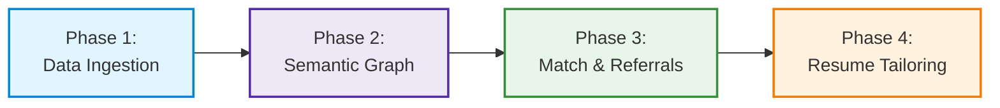
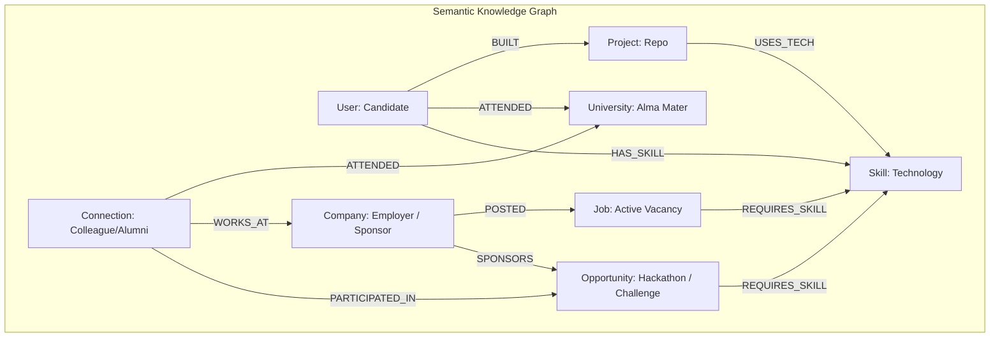
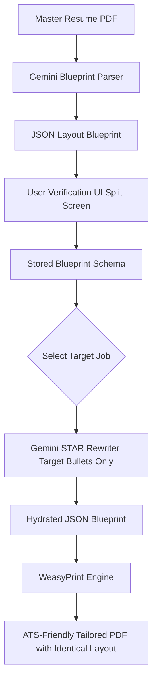

# ⛓️ Step-by-Step Data Pipeline Specification

This document details the exact execution mechanics across all 4 deterministic data pipeline phases of **CareerOS**.

---

## 📑 Phase Summary Matrix



---

## 🚀 Phase 1: Data Sourcing & Collection

The data ingestion pipeline avoids fragile open-ended web scraping agents. Instead, it relies on deterministic, official APIs and user-provided structured packages.

### 1.1 GitHub Repository Ingestion
- **Input**: User's GitHub Personal Access Token (PAT) or Public Username.
- **API Endpoint**: `GET https://api.github.com/user/repos` and `GET https://api.github.com/repos/{owner}/{repo}/readme`.
- **Extraction Targets**:
  - Repository name, description, stargazers, fork count.
  - Primary & auxiliary languages (`GET /repos/{owner}/{repo}/languages`).
  - Raw markdown strings from `README.md` and dependency manifests (`package.json`, `requirements.txt`, `Cargo.toml`).
- **Processing**: Code metadata is scrubbed, formatted as clean markdown blocks, and prepared for triplet extraction.

### 1.2 Golden Base Resume Upload
- **Input**: User's master resume in `.pdf` format.
- **Workflow**:
  1. Frontend uploads file to Supabase Storage bucket `resumes/{user_id}/golden_base.pdf`.
  2. Backend downloads the stream and extracts raw text using `pypdf` / `pdfplumber`.
  3. Text is categorized into sections: *Header*, *Education*, *Experience*, *Projects*, and *Skills*.

### 1.3 LinkedIn Data Package Ingestion
Due to anti-scraping protections and rate limiting on LinkedIn, users upload their official data archive export:
- **Input Files**: `Connections.csv`, `Positions.csv`, `Education.csv`.
- **Fields Extracted**:
  - `First Name`, `Last Name`, `Company`, `Position`, `Connected On`.
  - `School Name`, `Degree Name`, `Start Date`, `End Date`.
- **Standardization**: Company names and university titles are normalized using regex-based cleanups (e.g., `"Google LLC"` $\rightarrow$ `"Google"`, `"UC Berkeley"` $\rightarrow$ `"University of California, Berkeley"`).

### 1.4 Live Job Market Tracking (Public ATS APIs)
Direct ingestion from unauthenticated public job board APIs of target tech companies:
- **Greenhouse Boards API**: `GET https://boards-api.greenhouse.io/v1/boards/{company_name}/jobs?content=true`
- **Lever Postings API**: `GET https://api.lever.co/v0/postings/{company_name}?mode=json`
- **Output Schema**: Job title, requisitions, departments, location (remote/hybrid/onsite), and raw HTML/text job descriptions.

### 1.5 Hackathons, Hiring Challenges & Competitions (Unstop, Devpost, MLH)
Ingestion of student and developer opportunities that offer direct hiring tracks or prize recognition:
- **Unstop Opportunity Feeds & Public APIs**: Ingests national/global hackathons, corporate hiring challenges, and case competitions (e.g. Flipkart GRiD, Tata Imagination Challenge, Google Solution Challenge).
- **Devpost & MLH Public Feeds**: Extracts active web3/AI hackathons, prize pools, themes, submission deadlines, and eligibility criteria.
- **Extraction Targets**:
  - Event title, organizer/sponsor companies, prize pool, registration deadline.
  - Required tracks & tech stack (e.g. *GenAI*, *Web3*, *Full Stack*, *Robotics*).
  - Hiring opportunity tags (e.g., *Direct Interview Shortlist*, *PPI / PPO Guarantee*).

---

## 🧠 Phase 2: Building the Semantic Graph (Neo4j Schema)

Raw unstructured text from Phase 1 is parsed into strict semantic entity-relationship triplets by Google Gemini 1.5 Flash.



### 2.1 Gemini Triplet Extraction Prompt Blueprint
The backend sends unstructured text chunks to Gemini with a structured JSON schema constraint:

```json
{
  "entities": [
    {"type": "Project", "name": "careerOS", "description": "GraphRAG career platform"},
    {"type": "Skill", "name": "FastAPI", "category": "Backend"},
    {"type": "Skill", "name": "Neo4j", "category": "Database"},
    {"type": "University", "name": "Stanford University"},
    {"type": "Opportunity", "name": "Flipkart GRiD 6.0", "category": "Hackathon", "platform": "Unstop"}
  ],
  "relationships": [
    {"source": "careerOS", "relation": "USES_TECH", "target": "FastAPI"},
    {"source": "Candidate", "relation": "BUILT", "target": "careerOS"},
    {"source": "Flipkart", "relation": "SPONSORS", "target": "Flipkart GRiD 6.0"},
    {"source": "Flipkart GRiD 6.0", "relation": "REQUIRES_SKILL", "target": "FastAPI"}
  ]
}
```

### 2.2 Deterministic Cypher Upserts
FastAPI translates JSON triplets into atomic Cypher `MERGE` commands:

```cypher
// Upsert User and Project
MERGE (u:User {id: $user_id})
MERGE (p:Project {id: $project_id})
  ON CREATE SET p.name = $project_name, p.url = $project_url
MERGE (u)-[:BUILT]->(p)

// Link Project Tech Stack
MERGE (s:Skill {name: $skill_name})
  ON CREATE SET s.category = $category
MERGE (p)-[:USES_TECH]->(s)
MERGE (u)-[:HAS_SKILL {source: 'github'}]->(s);
```

---

## 🎯 Phase 3: Matchmaking & Hidden Referral Tracking

Rather than relying on vague LLM embeddings alone, matchmaking combines **Boolean Graph Intersection** with **Multi-Hop Path Traversal**.

### 3.1 Skill Compatibility & Gap Analysis
Computes coverage between a candidate's verified skills and active job requirements:

```cypher
MATCH (u:User {id: $user_id})
MATCH (j:Job {id: $job_id})-[:REQUIRES_SKILL]->(req:Skill)
OPTIONAL MATCH (u)-[:HAS_SKILL]->(req)
WITH j, count(req) AS total_skills, 
     collect(req.name) AS required_skills,
     collect(CASE WHEN (u)-[:HAS_SKILL]->(req) THEN req.name ELSE null END) AS matched_skills
RETURN j.title AS job_title,
       j.company AS company,
       total_skills,
       size(matched_skills) AS matched_count,
       (size(matched_skills) * 1.0 / total_skills) * 100 AS match_percentage,
       [s IN required_skills WHERE NOT s IN matched_skills] AS missing_skills;
```

### 3.2 Hidden Referral Path Traversal (Alumni & Network Bridge)
Finds warm referral connections working at the company posting the target job:

```cypher
MATCH (u:User {id: $user_id})-[:ATTENDED]->(univ:University)
MATCH (conn:Person)-[:ATTENDED]->(univ)
MATCH (conn)-[:WORKS_AT]->(c:Company)-[:POSTED]->(j:Job {id: $job_id})
RETURN conn.name AS referrer_name,
       conn.position AS referrer_position,
       c.name AS company_name,
       univ.name AS shared_university,
       j.title AS target_job,
       "Alumni Connection" AS referral_type;
```

### 3.3 Hackathon Matching & Complementary Teammate Discovery
Matches candidate to high-yield hackathons and discovers alumni/connections with complementary missing skills for team formation:

```cypher
// 1. Match Hackathons by User Tech Stack
MATCH (u:User {id: $user_id})
MATCH (opp:Opportunity {is_active: true})-[:REQUIRES_SKILL]->(req:Skill)
OPTIONAL MATCH (u)-[:HAS_SKILL]->(req)
WITH u, opp, count(req) AS total_skills,
     collect(req.name) AS required_skills,
     collect(CASE WHEN (u)-[:HAS_SKILL]->(req) THEN req.name ELSE null END) AS matched_skills
WITH u, opp, required_skills, matched_skills,
     [s IN required_skills WHERE NOT s IN matched_skills] AS missing_skills
WHERE size(matched_skills) * 1.0 / size(required_skills) >= 0.40

// 2. Find Alumni Connections who have the missing skills for a dream team
OPTIONAL MATCH (u)-[:ATTENDED]->(univ:University)<-[:ATTENDED]-(teammate:Person)
OPTIONAL MATCH (teammate)-[:HAS_SKILL]->(missing:Skill)
WHERE missing.name IN missing_skills
RETURN opp.title AS hackathon_name,
       opp.platform AS platform,
       opp.prize_pool AS prize_pool,
       opp.deadline AS registration_deadline,
       matched_skills,
       missing_skills,
       collect(DISTINCT {
         teammate_name: teammate.name,
         fills_skill: missing.name,
         shared_school: univ.name
       }) AS suggested_teammates;
```

---

## 🎨 Phase 4: Structural Layout Resume Tailoring

A major problem with standard AI resume creators is layout corruption. CareerOS solves this with the **Template Setup Wizard & JSON Blueprint Schema**.



### 4.1 JSON Layout Blueprint Schema
```json
{
  "header": {
    "name": "Jane Doe",
    "contact": "jane@example.com | github.com/janedoe | linkedin.com/in/janedoe"
  },
  "sections": [
    {
      "type": "EXPERIENCE",
      "heading": "Work Experience",
      "entries": [
        {
          "company": "TechCorp",
          "role": "Software Engineer",
          "dates": "2023 - Present",
          "bullets": [
            "{{TAILORED_BULLET_EXP_1_1}}",
            "{{TAILORED_BULLET_EXP_1_2}}"
          ]
        }
      ]
    },
    {
      "type": "PROJECTS",
      "heading": "Featured Projects",
      "entries": [
        {
          "name": "CareerOS",
          "tech_stack": "FastAPI, Neo4j, React, Supabase",
          "bullets": [
            "{{TAILORED_PROJECT_1_1}}",
            "{{TAILORED_PROJECT_1_2}}"
          ]
        }
      ]
    }
  ]
}
```

### 4.2 Dynamic STAR Tailoring Execution
When a target job is selected:
1. Gemini receives:
   - Target Job Requirements & Key Tech Stack.
   - User's verified project & work history from the Knowledge Graph.
   - The specific placeholder fields.
2. Gemini outputs tailored bullet points adhering to the **STAR method** (Situation, Task, Action, Result) with quantified metrics.
3. The backend injects the generated bullets into the JSON blueprint.
4. `weasyprint` renders the HTML/CSS template to PDF with identical styling, fonts, margins, and section orders.
